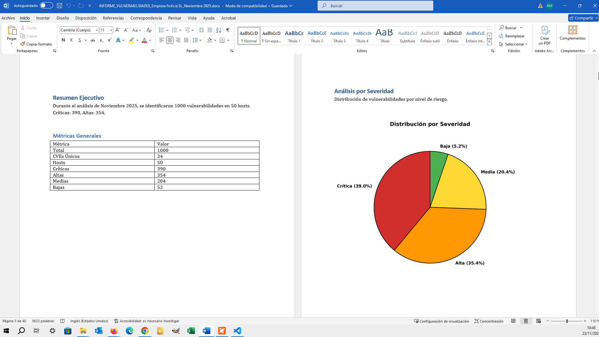

# 🛡️ Automatizador de Informes de Vulnerabilidades

> **Transforma datos de auditoría en informes ejecutivos usando Inteligencia de Fuentes Abiertas (OSINT) y automatización.**


## 📋 Descripción del Proyecto

En el día a día de un analista de seguridad, "reportar" consume tiempo valioso que debería dedicarse a "investigar". Este proyecto es un desarrollo propio diseñado para **automatizar el ciclo de documentación post-auditoría**.

El script ingesta datos de vulnerabilidades (simulando un export de herramientas como Nessus u OpenVAS), consulta la API oficial del **NIST (National Vulnerability Database)** para enriquecer la información técnica y genera un documento Word (`.docx`) con métricas, gráficas y tablas formateadas profesionalmente.

### 📸 Vistazo Rápido (Demo)

**1. Informe Final (Generación Automática):**
El script procesa los datos crudos y maqueta un documento Word con tablas y gráficos vectoriales listos para entregar.


**2. Ejecución en Terminal:**
Feedback en tiempo real sobre el progreso de consulta a la API y generación de gráficos.


---

### 🛡️ Nota de Seguridad y Privacidad
> *Por razones de seguridad y privacidad, las demostraciones de este repositorio utilizan un **archivo de datos sintético de 1.000 vulnerabilidades generado por IA** (`datos_prueba_1000_vulns.xlsx`). Esto permite realizar pruebas de estrés (stress testing) y demostrar la capacidad de procesamiento del script sin comprometer información confidencial de ninguna infraestructura real.*

---

### 🚀 Características Técnicas

* **Conexión API Robusta**: Cliente HTTP personalizado para consultar `services.nvd.nist.gov` con gestión de *rate-limiting* y reintentos automáticos.
* **Integridad de Datos (TTL & Caché)**: El sistema implementa una caché local JSON con un *Time To Live* (TTL) de 30 días. Esto optimiza el rendimiento evitando consultas redundantes, pero garantiza que cualquier cambio crítico en una vulnerabilidad (ej: recalificación de severidad) se actualice automáticamente tras expirar el registro local.
* **Generación Dinámica de Documentos**: Uso avanzado de la librería `python-docx` para manipular el XML de Word, inyectando tablas, estilos corporativos e hipervínculos funcionales.
* **Seguridad Operacional**: El código separa la lógica de las credenciales (API Keys no hardcodeadas).

## 🛠️ Stack Tecnológico

* **Lenguaje:** Python 3
* **Librerías Clave:** `Pandas` (Análisis de datos), `Matplotlib` (Visualización), `Requests` (Conectividad API), `Python-Docx` (Reporting).
* **Entorno:** Compatible con Windows y Linux.

## 📦 Instalación y Uso

1.  **Preparar el entorno:**
    Navega hasta la carpeta del proyecto e instala las dependencias necesarias:
    ```bash
    pip install -r requirements.txt
    ```

2.  **Configuración (Recomendado):**
    Edita el archivo `ejecutar_informe.bat` para añadir tu propia API KEY de NVD. Si no lo haces, el script funcionará pero con las limitaciones de velocidad de la API pública.

3.  **Ejecutar:**
    Haz doble clic en el archivo `ejecutar_informe.bat`. 
    Sigue las instrucciones en pantalla e introduce el nombre del archivo de datos incluido para la prueba: `datos_prueba_1000_vulns.xlsx`.

---
## Estado del proyecto
- [x] Terminado
- [ ] En desarrollo
- [ ] En pausa

## Autor
**Ángel Mariano Álvarez López**
📧 [angelmarianoalvarez@gmail.com](mailto:angelmarianoalvarez@gmail.com)