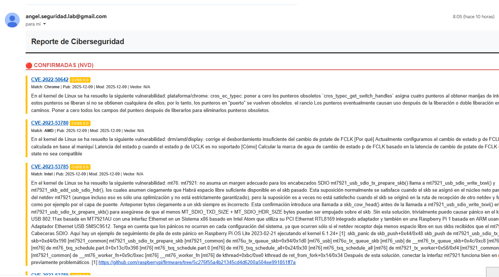
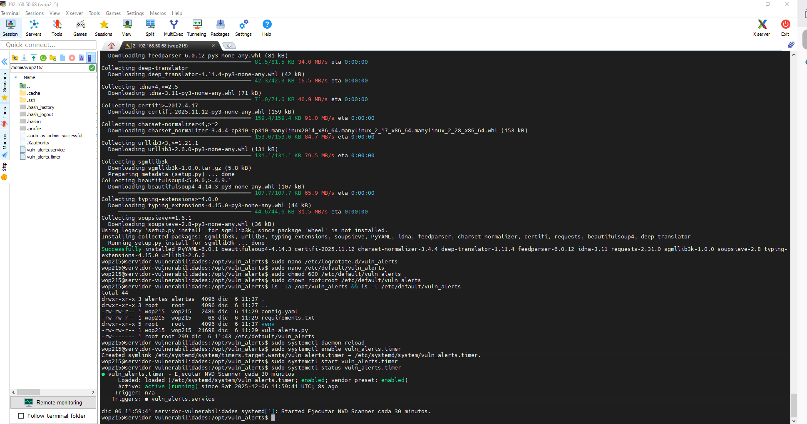
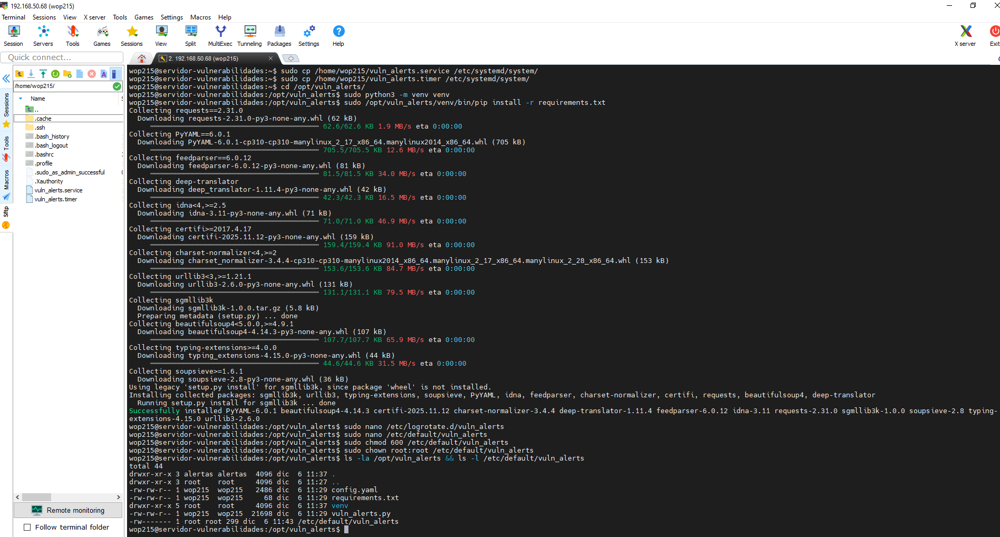

# 🛡️ Sistema de Alertas de Vulnerabilidad (NVD Scanner)

> **Monitorización continua y detección temprana de CVEs críticas usando la API oficial del NIST y automatización Python.**


## 📋 Descripción del Proyecto

En el panorama actual de ciberamenazas, el tiempo de reacción es crítico. Este proyecto es un **servicio de vigilancia digital (Daemon)** diseñado para monitorizar en tiempo real la publicación de nuevas vulnerabilidades (CVEs) y noticias de seguridad que afectan a la infraestructura de la organización.

El sistema consulta periódicamente la **National Vulnerability Database (NVD)**, filtra los resultados basándose en los fabricantes (tecnologías) utilizados por la empresa y notifica inmediatamente al equipo de seguridad vía correo electrónico.

### 📸 Vistazo Rápido (Demo)

**1. Alertas en Tiempo Real:**
El sistema envía correos detallados con el Score CVSS, vectores de ataque y referencias oficiales. También agrupa noticias de fuentes OSINT (BleepingComputer, HackerNews).

*Arriba: Vista del buzón con alertas clasificadas. Abajo: Detalle de una alerta técnica.*


**2. Ejecución Automatizada (Systemd):**
El script se ejecuta como un servicio de fondo en Linux, gestionado por `systemd` y `timers` para garantizar una vigilancia 24/7 sin intervención humana.


---

### 🛡️ Seguridad y Operaciones (OpSec)

Este proyecto sigue principios de **"Secure by Design"**:

1.  **Permisos Restrictivos:** Los archivos de configuración que contienen claves API y credenciales SMTP tienen permisos `600` (solo lectura para el dueño) y pertenecen a `root`, evitando accesos no autorizados.
    
2.  **No Hardcoding:** Las credenciales se cargan desde variables de entorno o archivos de configuración protegidos, nunca están en el código fuente.
3.  **Persistencia:** Utiliza una base de datos `SQLite` para evitar duplicidad de alertas y mantener un registro de auditoría (`Logs.PNG`).

---

### 🚀 Características Técnicas

* **Ingesta Híbrida**: 
    * **NIST NVD API**: Para vulnerabilidades confirmadas (CVEs).
    * **RSS Feeds**: Para "Alertas Tempranas" y noticias de seguridad (INCIBE, Microsoft MSRC, Debian Security).
* **Filtrado Inteligente**: 
    * **Regex Precompilada**: Motor de búsqueda optimizado para detectar fabricantes específicos en descripciones largas.
    * **Caché de Traducción**: Implementa `lru_cache` para minimizar llamadas a APIs de traducción externa.
* **Resiliencia**: Uso de la librería `backoff` para manejar reintentos exponenciales en caso de fallos de red o saturación de la API del NIST.

## 🛠️ Stack Tecnológico

* **Lenguaje:** Python 3.10+
* **Orquestación:** Systemd (Linux Services & Timers).
* **Librerías Clave:** `Requests`, `SQLite3`, `Feedparser`, `Deep-translator`, `SMTPLib`.

## 📦 Instalación y Uso

1.  **Clonar y preparar entorno virtual:**
    ```bash
    git clone [https://github.com/TU_USUARIO/vuln-alerts.git](https://github.com/TU_USUARIO/vuln-alerts.git)
    cd /opt/vuln_alerts
    python3 -m venv venv
    source venv/bin/activate
    pip install -r requirements.txt
    ```

2.  **Configuración Segura:**
    Edita el archivo `config.yaml` y asegura los permisos:
    ```bash
    sudo chmod 600 config.yaml
    sudo chown root:root config.yaml
    ```

3.  **Despliegue como Servicio:**
    Copia los archivos `.service` y `.timer` a `/etc/systemd/system/` y actívalos:
    ```bash
    sudo systemctl enable --now vuln_alerts.timer
    ```

---
## Estado del proyecto
- [x] Terminado (Versión 1.0 Estable)
- [ ] En desarrollo
- [ ] En mantenimiento

## Autor
**Ángel Mariano Álvarez López**
📧 [angelmarianoalvarez@gmail.com](mailto:angelmarianoalvarez@gmail.com)