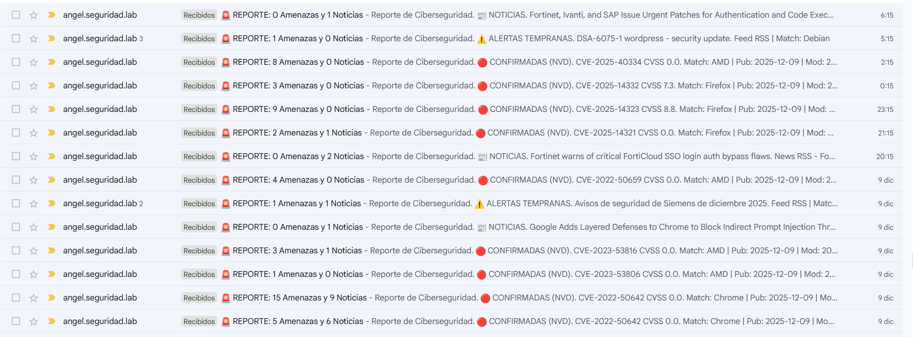
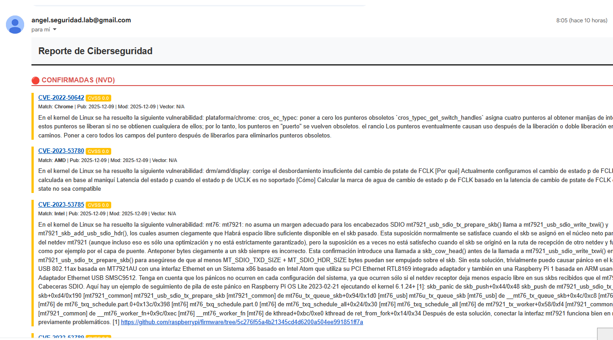
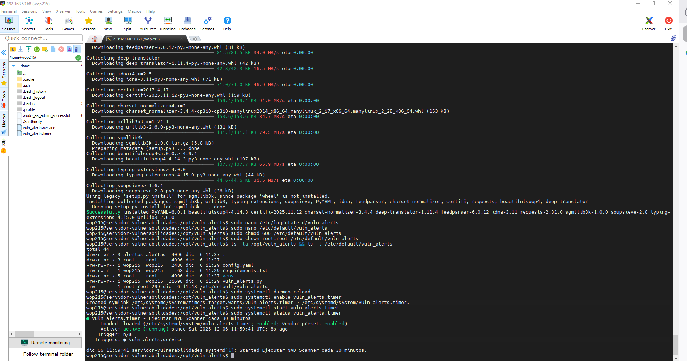
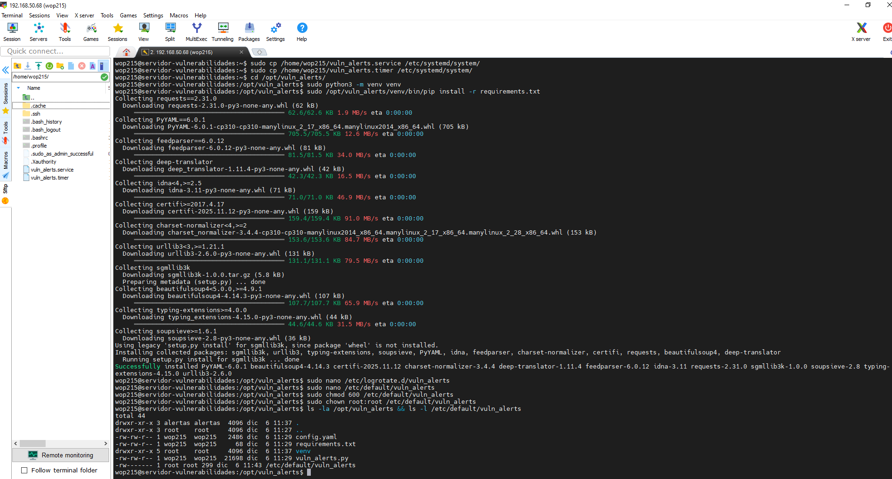

# 🛡️ Sistema de Alertas de Vulnerabilidad (NVD Scanner)

> **Monitorización continua y detección temprana de CVEs críticas usando la API oficial del NIST y automatización Python.**


## 📋 Descripción del Proyecto

En el panorama actual de ciberamenazas, el tiempo de reacción es crítico. Este proyecto es un **servicio de vigilancia digital (Daemon)** diseñado para monitorizar en tiempo real la publicación de nuevas vulnerabilidades (CVEs) y noticias de seguridad que afectan a la infraestructura de la organización.

El sistema consulta periódicamente la **National Vulnerability Database (NVD)**, filtra los resultados basándose en los fabricantes (tecnologías) utilizados por la empresa y notifica inmediatamente al equipo de seguridad vía correo electrónico.

### 📸 Vistazo Rápido (Demo)

**1. Alertas en Tiempo Real:**
El sistema envía correos detallados con el Score CVSS, vectores de ataque y referencias oficiales. También agrupa noticias de fuentes OSINT (BleepingComputer, HackerNews).

*Arriba: Vista del buzón con alertas clasificadas. Abajo: Detalle de una alerta técnica.*


**2. Ejecución Automatizada (Systemd):**
El script se ejecuta como un servicio de fondo en Linux, gestionado por `systemd` y `timers` para garantizar una vigilancia 24/7 sin intervención humana.


---

### 🛡️ Seguridad y Operaciones (OpSec)

Este proyecto sigue principios de **"Secure by Design"**:

1. **Permisos Restrictivos:** Los archivos de configuración que contienen claves API y credenciales SMTP tienen permisos `600` (solo lectura para el dueño) y pertenecen a `root`, evitando accesos no autorizados.
   
2. **No Hardcoding:** Las credenciales se cargan exclusivamente desde variables de entorno en un archivo de sistema protegido (`/etc/default/vuln_alerts`), nunca están en el código fuente.
3. **Persistencia sin Duplicados:** Base de datos `SQLite` que registra cada alerta enviada, garantizando que ningún CVE se notifique dos veces aunque el servicio se reinicie.
4. **Resiliencia en el Envío:** El sistema solo marca una alerta como enviada en la base de datos **después de confirmar** que el correo fue entregado exitosamente. Si el servidor SMTP falla, la alerta se reintenta automáticamente en la siguiente ejecución.
5. **Timeout de Servicio Robusto:** El timer de systemd permite hasta 5 minutos de ejecución, suficiente para cubrir consultas a la API NVD, feeds RSS y traducción de resultados.

---

### 🚀 Características Técnicas

* **Ingesta Híbrida**:
    * **NIST NVD API v2.0**: Para vulnerabilidades confirmadas (CVEs) con score CVSS configurable.
    * **RSS Feeds**: Para "Alertas Tempranas" y noticias de seguridad (INCIBE, Microsoft MSRC, Debian Security, BleepingComputer, The Hacker News).
* **Filtrado Inteligente**:
    * **Regex Precompilada**: Motor de búsqueda optimizado con `re.IGNORECASE` para detectar fabricantes específicos en descripciones largas con una sola pasada.
    * **Caché de Traducción**: Implementa `lru_cache` para minimizar llamadas a APIs de traducción externa; textos idénticos se traducen una sola vez por ejecución.
* **Configuración Declarativa**: Todo el comportamiento del sistema (keywords, fuentes RSS, score mínimo) se controla desde un único `config.yaml` sin tocar el código.
* **Modo Prueba (`--dry-run`)**: Permite probar el sistema completo sin enviar emails ni modificar la base de datos, ideal para validaciones.

## 🛠️ Stack Tecnológico

* **Lenguaje:** Python 3.10+
* **Orquestación:** Systemd (Linux Services & Timers)
* **Librerías Clave:** `Requests`, `SQLite3`, `Feedparser`, `Deep-translator`, `SMTPLib`

## 📦 Instalación y Uso

1. **Clonar y preparar entorno:**
    ```bash
    git clone https://github.com/TU_USUARIO/vuln-alerts.git
    cd /opt/vuln_alerts
    python3 -m venv venv
    source venv/bin/activate
    pip install -r requirements.txt
    ```

2. **Configuración Segura:**
    Edita el archivo `config.yaml` con tus keywords y asegura los permisos:
    ```bash
    sudo chmod 600 config.yaml
    sudo chown root:root config.yaml
    ```

3. **Despliegue como Servicio:**
    Copia los archivos `.service` y `.timer` a `/etc/systemd/system/` y actívalos:
    ```bash
    sudo systemctl daemon-reload
    sudo systemctl enable --now vuln_alerts.timer
    ```

4. **Verificar que funciona:**
    ```bash
    sudo systemctl status vuln_alerts.timer
    tail -f /opt/vuln_alerts/vuln_alerts.log
    ```

Para instrucciones detalladas de despliegue, credenciales SMTP y diagnóstico, consulta la **Guía de Despliegue y Mantenimiento** incluida en este repositorio.

---

## Estado del proyecto
- [x] En producción (Versión estable)
- [ ] En desarrollo
- [ ] En mantenimiento

## Autor
**Ángel Mariano Álvarez López**
📧 [angelmarianoalvarez@gmail.com](mailto:angelmarianoalvarez@gmail.com)
