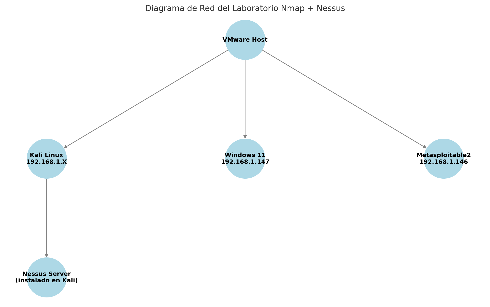
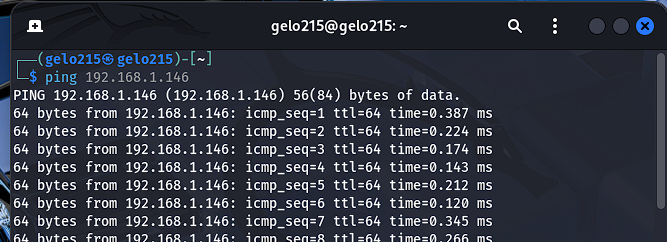
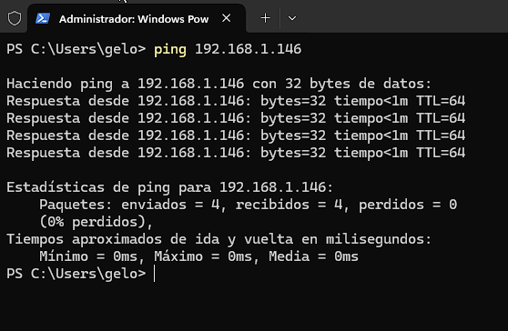

# 🔍 Análisis de Vulnerabilidades con Nmap y Nessus

> **Ejercicio de auditoría de seguridad: Identificación, análisis y catalogación de vulnerabilidades en un entorno virtualizado.**


---

## 📋 Descripción del Escenario

Este proyecto documenta un ciclo completo de **Vulnerability Assessment** (Evaluación de Vulnerabilidades).  
El objetivo fue desplegar un laboratorio controlado con activos heredados (Legacy) para simular una auditoría real, ejecutando fases de descubrimiento, escaneo y reporte.

### Arquitectura de Red

El entorno se virtualizó sobre **VMware Workstation** en una red NAT aislada.



- **Auditor (Atacante):** Kali Linux (`192.168.1.144`)
- **Objetivo (Víctima):** Metasploitable2 (`192.168.1.146`)
- **Cliente (Testigo):** Windows 11 (`192.168.1.147`)

---

## 1. Validación de Conectividad

### Desde Kali Linux (Atacante)


### Desde Windows 11 (Cliente)


---

## 2. Reconocimiento con Nmap

```text
PORT      STATE SERVICE     VERSION
21/tcp    open  ftp         vsftpd 2.3.4
22/tcp    open  ssh         OpenSSH 4.7p1 Debian 8ubuntu1
23/tcp    open  telnet      Linux telnetd
25/tcp    open  smtp        Postfix smtpd
53/tcp    open  domain      ISC BIND 9.4.2
80/tcp    open  http        Apache httpd 2.2.8
111/tcp   open  rpcbind     2
139/tcp   open  netbios-ssn Samba smbd 3.X - 4.X
445/tcp   open  netbios-ssn Samba smbd 3.0.20-Debian
512/tcp   open  exec        netkit-rsh rexecd
513/tcp   open  login
514/tcp   open  shell
1099/tcp  open  java-rmi    GNU Classpath grmiregistry
1524/tcp  open  bindshell   Metasploitable root shell
2049/tcp  open  nfs         2-4
2121/tcp  open  ftp         ProFTPD 1.3.1
3306/tcp  open  mysql       MySQL 5.0.51a-3ubuntu5
5432/tcp  open  postgresql  PostgreSQL DB 8.3.0 - 8.3.7
5900/tcp  open  vnc         VNC (protocol 3.3)
6000/tcp  open  X11         (access denied)
6667/tcp  open  irc         UnrealIRCd
8009/tcp  open  ajp13       Apache Jserv (Protocol v1.3)
8180/tcp  open  http        Apache Tomcat/Coyote JSP engine 1.1
```

---

## 3. Análisis de Vulnerabilidades con Nessus

### 🧩 Matriz de Hallazgos

| Severidad | Vulnerabilidad Detectada               | Puerto   |
|-----------|----------------------------------------|----------|
| 🔴 **Crítica** | UnrealIRCd Backdoor Detection          | 6667     |
| 🔴 **Crítica** | Bind Shell Backdoor Detection          | 1524     |
| 🔴 **Crítica** | VNC Server 'password' Password         | 5900     |
| 🔴 **Crítica** | Debian OpenSSH/OpenSSL RNG Weakness    | 22       |
| 🟠 **Alta**    | rlogin/rsh Service Detection           | 513/514  |
| 🟠 **Alta**    | Samba Badlock Vulnerability            | 445      |
| 🟠 **Alta**    | ISC BIND Service Downgrade / DoS       | 53       |
| 🟡 **Media**   | SMB Signing not required               | 445      |
| 🟡 **Media**   | HTTP TRACE / TRACK Methods Allowed     | 80       |
| 🟡 **Media**   | SSL Certificate Cannot Be Trusted      | 8443     |

---

## 4. Comparativa: Nmap vs Nessus

| Herramienta | Propósito Principal | Ejemplo |
|-------------|---------------------|---------|
| **Nmap**    | Inventario: Detecta puertos abiertos y servicios. | Detectó **vsftpd 2.3.4** en el puerto 21. |
| **Nessus**  | Evaluación: Revisa vulnerabilidades y CVEs. | Identificó la *Backdoor* de **vsftpd 2.3.4** (CVE-2011-2523). |

---

## Estado del proyecto

- [x] Terminado  
- [ ] En desarrollo  
- [ ] En pausa  

---

## Autor

**Ángel Mariano Álvarez López**  
📧 angelmarianoalvarez@gmail.com
