# SSH Seguro y Robusto: Autenticación por Clave Pública, Banner Legal, UFW, Fail2ban y Port Knocking

## 📝 Descripción del Proyecto

Este proyecto forma parte del curso "Seguridad Informática (IFCT0109) - Seguridad en equipos informáticos (MF0486_3)" del SEPE. Se centra en la **implementación de un entorno SSH (Secure Shell) avanzado y altamente seguro en una máquina Kali Linux**, con el objetivo principal de fortalecer el acceso remoto al servidor, protegerlo contra ataques comunes y mantener una postura de seguridad proactiva.

El ejercicio aborda la configuración de múltiples capas de seguridad, incluyendo:
* **Port Knocking** para la ocultación de servicios.
* **UFW (Uncomplicated Firewall)** para una gestión robusta de reglas de firewall.
* **Hardening avanzado** del servicio SSH.
* **Fail2ban** para la protección contra ataques de fuerza bruta.
* **Autenticación por clave pública** y políticas de acceso restrictivas.
* **Monitorización y logging avanzado** de accesos SSH.

Este proyecto ha sido **finalizado** con éxito, demostrando la aplicación práctica de conceptos de seguridad avanzada en un entorno controlado.

## 🛠️ Tecnologías y Herramientas Utilizadas

* **Sistema Operativo:** Kali Linux (Máquina Virtual)
* **Servicio de Acceso Remoto:** OpenSSH Server
* **Cortafuegos:** UFW (Uncomplicated Firewall)
* **Detección y Bloqueo de Intrusiones:** Fail2ban
* **Ocultamiento de Puertos:** Knockd (Port Knocking)
* **Generación de Claves:** SSH-keygen
* **Cliente SSH (Windows):** PuTTY (para pruebas de conexión)

## 🚀 Fases del Ejercicio e Implementación Detallada

A continuación, se describen las fases clave de la implementación, los pasos realizados y los principales hallazgos y configuraciones.

### FASE 1: Preparación e Instalación de Software Base

1.  **Actualización del sistema e instalación de componentes necesarios**:
    Se actualizó el sistema y se instalaron `openssh-server`, `ufw`, `fail2ban` y `knockd`.
    ```bash
    sudo apt update && sudo apt upgrade -y
    sudo apt install openssh-server ufw fail2ban knockd -y
    ```
    Se verificó la instalación de los componentes:
    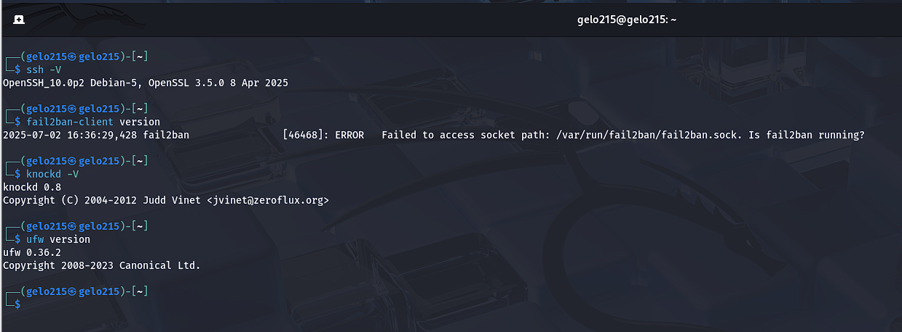

2.  **Copia de seguridad de configuraciones originales**:
    Se crearon copias de seguridad de los archivos de configuración `sshd_config` y `jail.conf` en `/etc/backups` para asegurar un rollback si fuera necesario.
    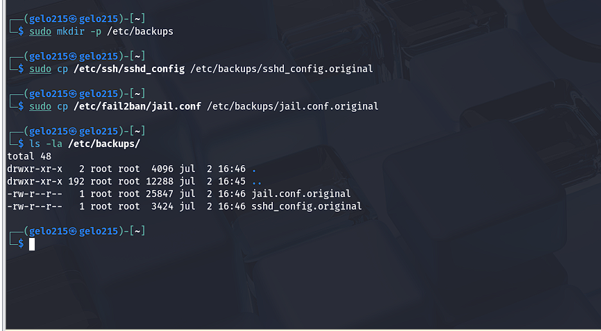

3.  **Configuración básica inicial de SSH**:
    Se modificó el archivo `/etc/ssh/sshd_config` para:
    * Cambiar el puerto SSH por defecto al `2222`.
    * Establecer `Protocol 2`.
    * Deshabilitar el login de `root` (`PermitRootLogin no`).
    * Habilitar la autenticación por clave pública (`PubkeyAuthentication yes`).
    * Deshabilitar la autenticación por contraseña (se habilitará posteriormente para pruebas y luego se deshabilitará) (`PasswordAuthentication yes`).
    * Configurar `MaxAuthTries 3` y `LoginGraceTime 60`.
    * Especificar `AllowUsers sshuser`.
    * Configurar el logging a `LogLevel VERBOSE` y `SyslogFacility AUTH`.
    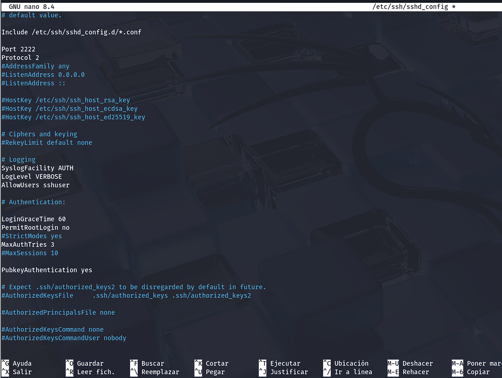

4.  **Creación de usuario SSH específico**:
    Se creó el usuario `sshuser`, se le asignó una contraseña segura y se añadió al grupo `sudo` para permitirle ejecutar comandos con privilegios elevados cuando sea necesario.
    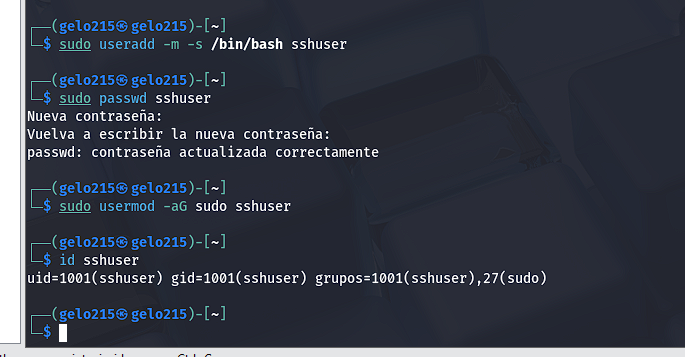

### FASE 2: Configuración Avanzada de Hardening SSH

1.  **Configuración avanzada de SSH**:
    Se realizaron ajustes adicionales en `/etc/ssh/sshd_config` para mejorar la seguridad:
    * Se configuraron timeouts de inactividad.
    * Se establecieron límites de conexiones.
    * Se deshabilitó el túnel X11 forwarding y la reenvío de agentes, reduciendo la superficie de ataque.
    * Se aseguró que `PermitEmptyPasswords` estuviera en `no`.
    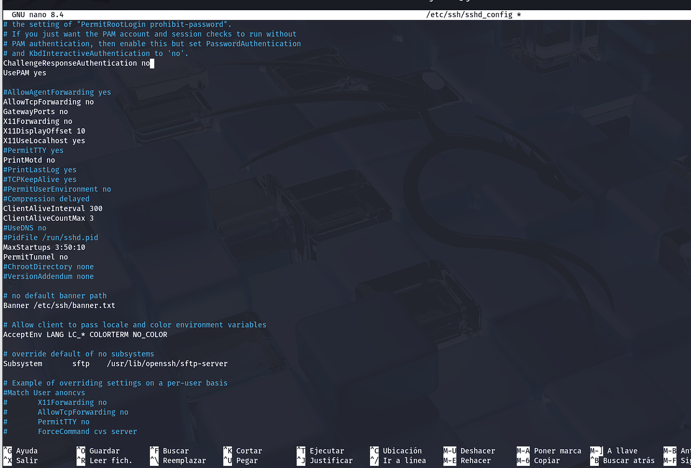

2.  **Creación de banner de advertencia**:
    Se creó el archivo `/etc/ssh/banner.txt` con un mensaje de advertencia legal. Este banner se muestra a cualquier usuario que intente conectar vía SSH, informando sobre la naturaleza privada del sistema y las consecuencias de accesos no autorizados.
    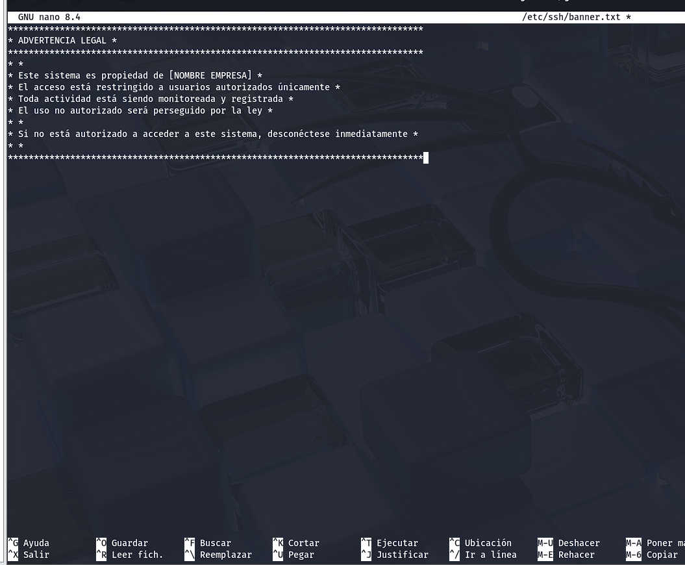

3.  **Configuración de autenticación por clave pública**:
    Se generó un par de claves SSH (ed25519) para `sshuser` utilizando `ssh-keygen`. Las claves pública (`id_ed25519.pub`) y privada (`id_ed25519`) fueron guardadas en el directorio `.ssh` del usuario. Se configuraron los permisos adecuados para `~/.ssh` y `authorized_keys` para garantizar la seguridad.
    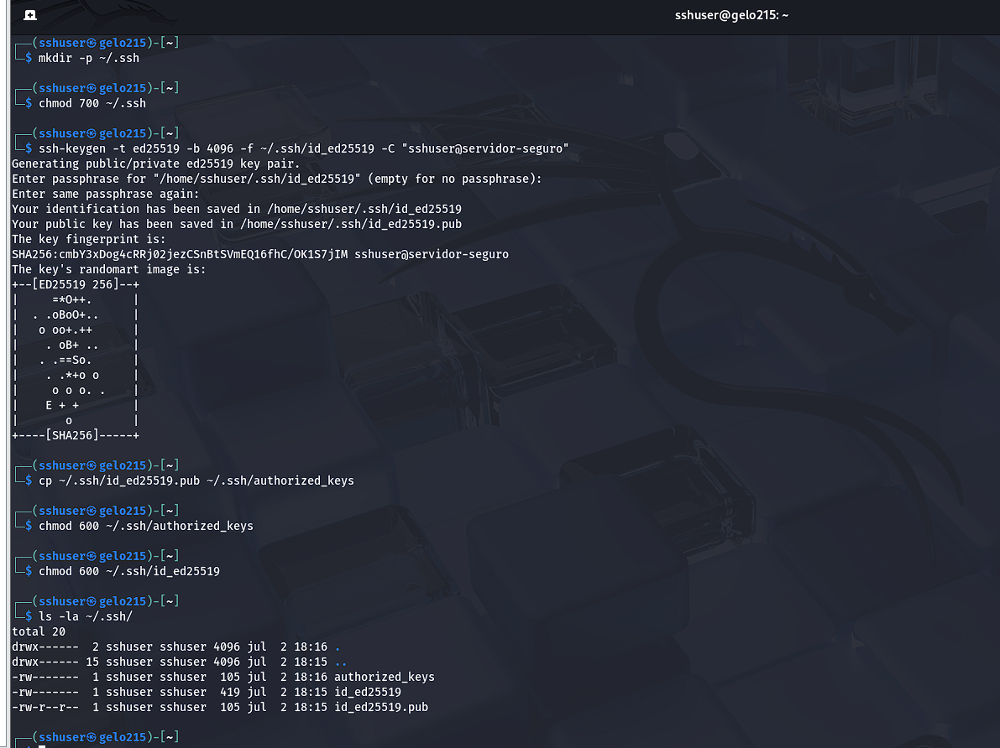

### FASE 3: Configuración de UFW Firewall

1.  **Configuración inicial de UFW**:
    Se reseteó UFW a su estado por defecto y se configuraron las políticas predeterminadas para **denegar todo el tráfico entrante** y **permitir todo el tráfico saliente**. También se permitió el tráfico loopback para el correcto funcionamiento interno del sistema.
    

2.  **Configuración de reglas básicas (temporal)**:
    Se añadieron reglas temporales en UFW para permitir la conexión al puerto SSH personalizado (`2222/tcp`) y los puertos de Port Knocking (`7000/tcp`, `8000/tcp`, `9000/tcp`). Posteriormente, la regla SSH se eliminará para que Port Knocking sea la única forma de acceso. Se habilitó UFW.
    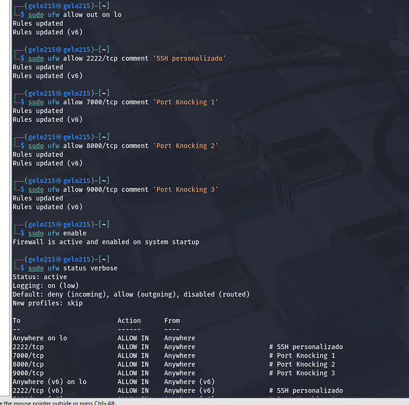

3.  **Configuración de logging en UFW**:
    Se habilitó el logging detallado de UFW para registrar las conexiones bloqueadas y permitidas, lo que es crucial para la auditoría de seguridad. Se instaló `rsyslog` para una gestión y visualización de logs avanzada.
    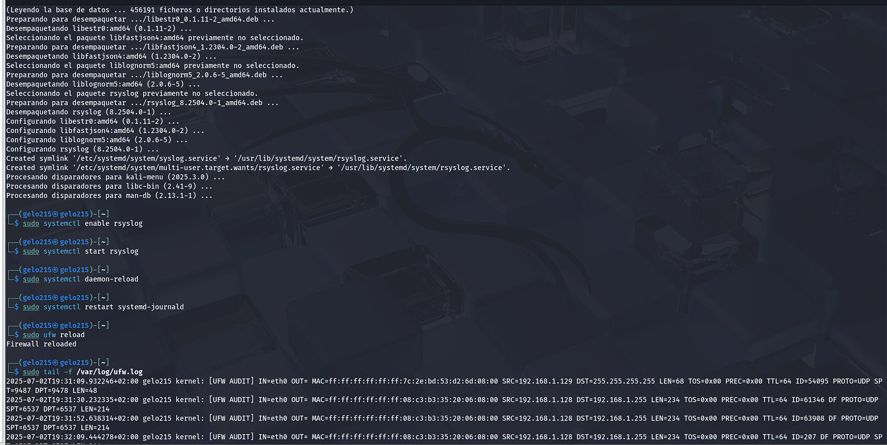

### FASE 4: Configuración de Port Knocking

1.  **Habilitación y configuración de knockd**:
    Se editó `/etc/default/knockd` para asegurar que el servicio se inicie automáticamente (`START_KNOCKD=1`) y se especificó la interfaz de red (`eth0` en este caso) donde `knockd` escuchará los intentos de knocking.
    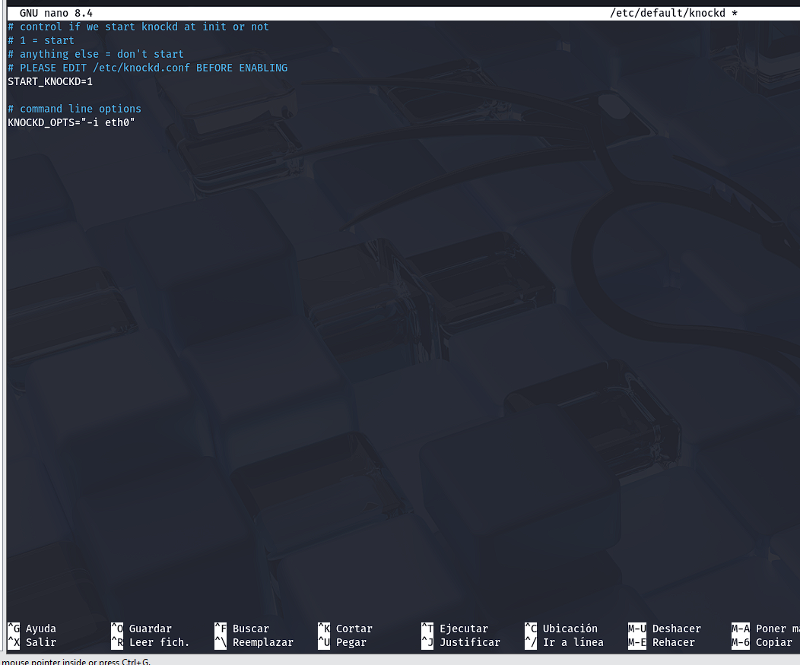

2.  **Configuración principal de knockd**:
    Se modificó `/etc/knockd.conf` para definir las secuencias de `Port Knocking`:
    * **Secuencia para abrir SSH**: `7000, 8000, 9000` (se abrirá el puerto SSH).
    * **Secuencia para cerrar SSH**: `9000, 8000, 7000` (se cerrará el puerto SSH).
    * **Secuencia de emergencia**: `1111, 2222, 3333` (para restablecer el acceso en caso de problemas).
    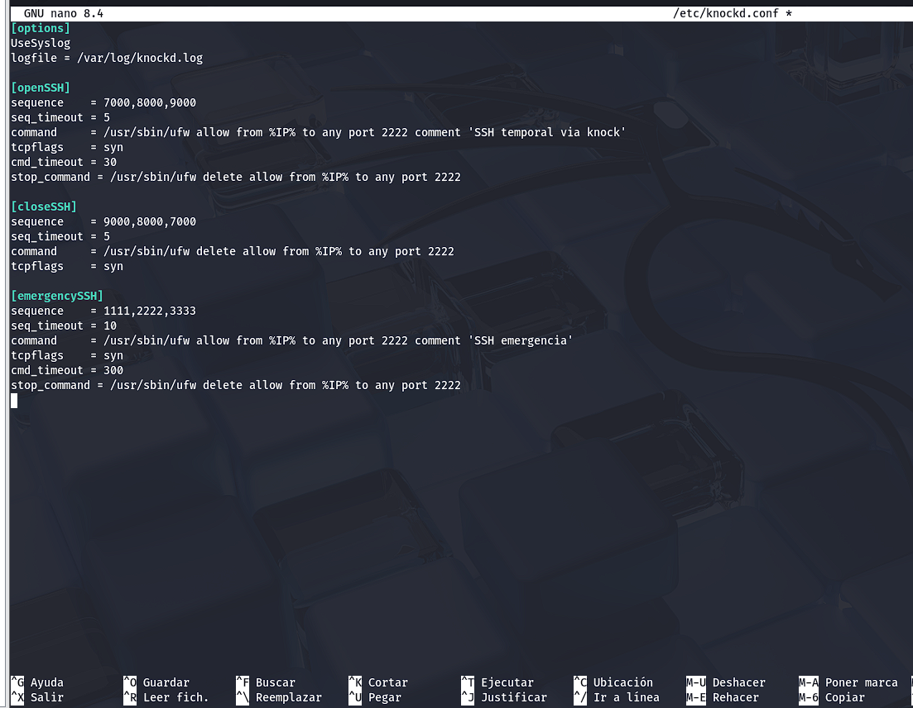

3.  **Eliminación de regla SSH directa en UFW**:
    Una vez configurado `knockd`, la regla SSH directa (`ufw allow 2222/tcp`) fue eliminada de UFW, haciendo que el acceso SSH solo fuera posible después de la secuencia correcta de Port Knocking.

### FASE 5: Configuración de Fail2Ban

1.  **Configuración de Fail2Ban para SSH y Knockd**:
    Se creó el archivo `jail.local` para sobrescribir la configuración por defecto y personalizar las jails para `sshd` y `knockd`. Se definieron los siguientes parámetros:
    * `bantime`: Duración del bloqueo de IPs.
    * `findtime`: Ventana de tiempo para intentos fallidos.
    * `maxretry`: Número máximo de intentos antes del bloqueo.
    * `ignoreip`: IPs que serán ignoradas por Fail2Ban (por ejemplo, la IP del administrador).
    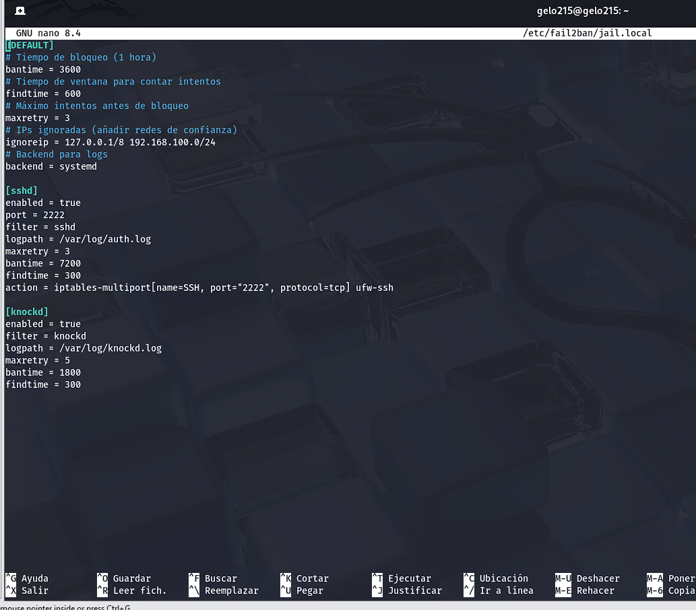

2.  **Creación de filtro personalizado para knockd**:
    Se creó el filtro `/etc/fail2ban/filter.d/knockd.conf` para que Fail2Ban pudiera interpretar los logs de `knockd` y detectar intentos fallidos de Port Knocking, permitiendo el bloqueo de IPs maliciosas.
    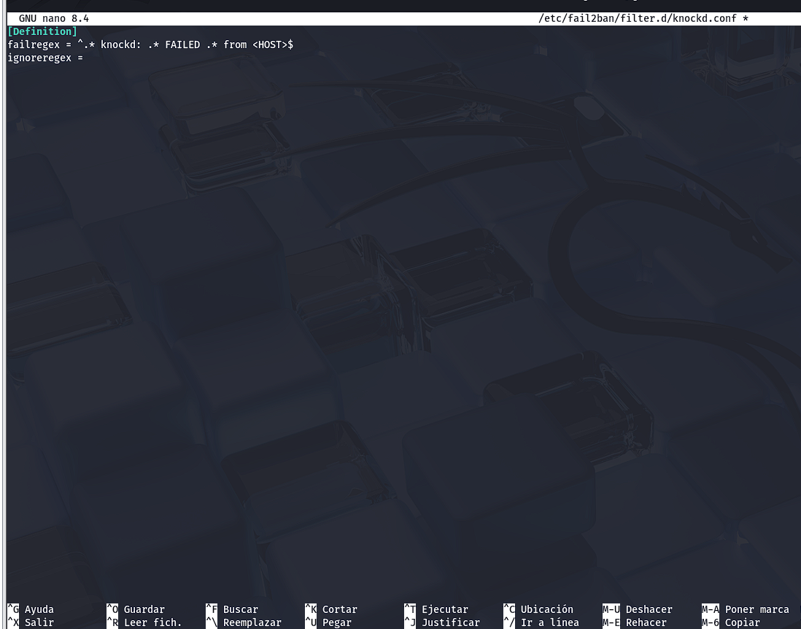

3.  **Creación de acción personalizada para UFW**:
    Se creó la acción `/etc/fail2ban/action.d/ufw-ssh.conf` para permitir que Fail2Ban interactuara directamente con UFW, añadiendo y eliminando reglas de bloqueo de IPs de forma dinámica.
    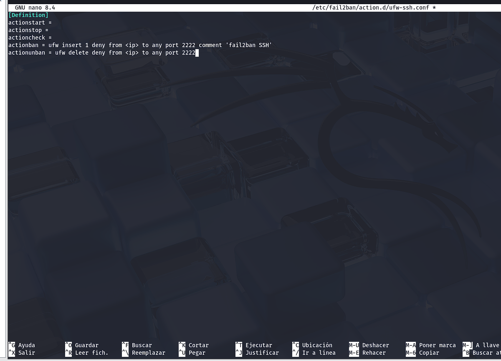

### FASE 6: Configuración Final y Pruebas

1.  **Reiniciar servicios y verificar estados**:
    Se reiniciaron los servicios `ssh`, `knockd` y `fail2ban` para asegurar que todas las configuraciones fueran aplicadas correctamente. Se verificó el estado (`active (running)`) de cada servicio.
    

2.  **Configuración y uso del script de monitorización en tiempo real**:
    Se creó un script `monitor-ssh.sh` (`/usr/local/bin/monitor-ssh.sh`) que permite monitorizar en tiempo real los logs de SSH (`auth.log`), Knockd (`knockd.log`), UFW (`ufw.log`) y el estado de Fail2Ban, proporcionando una visión consolidada de la actividad de seguridad.
    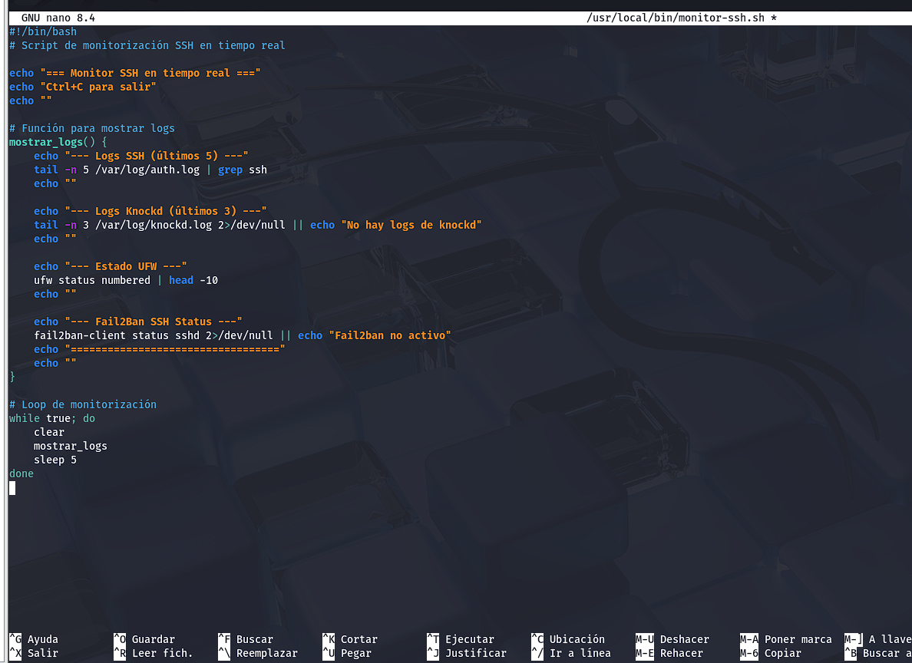

3.  **Verificación de la dirección IP del servidor**:
    Se obtuvo la dirección IP del servidor objetivo (ej. `192.168.1.144`) para las pruebas de conexión desde el cliente.
    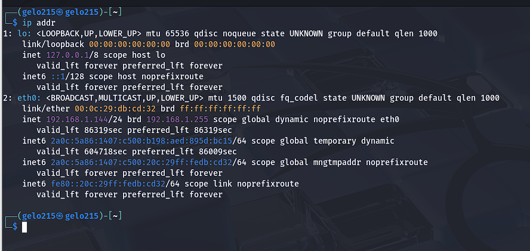

4.  **Pruebas de conexión desde el cliente**:
    Se realizaron pruebas de conexión SSH desde un cliente externo (Kali Linux o Windows), verificando que el acceso solo era posible después de realizar la secuencia correcta de Port Knocking. Se comprobó que el banner de advertencia se mostraba correctamente al establecer la conexión.
    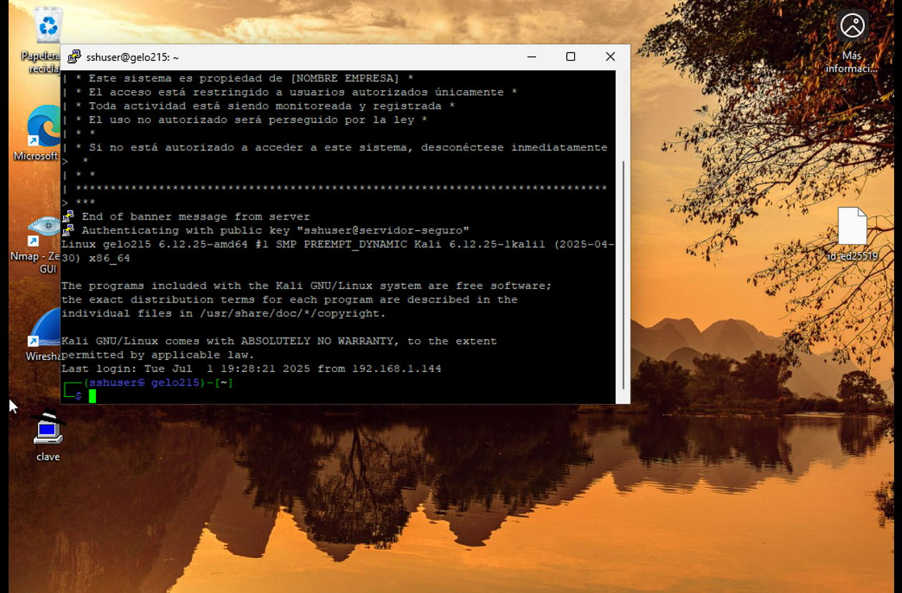

### FASE 7: Validación y Resultados

1.  **Pruebas de conectividad y seguridad**:
    Se verificó que el acceso SSH solo era posible después de un Port Knocking correcto. Se realizaron intentos de conexión fallidos para confirmar que Fail2Ban bloqueaba las IPs tras alcanzar el `maxretry`. También se comprobó que UFW registraba y bloqueaba el tráfico no autorizado.

2.  **Verificación de logs y monitorización**:
    Se utilizó el script de monitorización y comandos `tail -f` para observar los logs (`auth.log`, `knockd.log`, `ufw.log`) en tiempo real, confirmando que todas las actividades de seguridad (intentos de conexión, bloqueos, knocking) se registraban correctamente.
    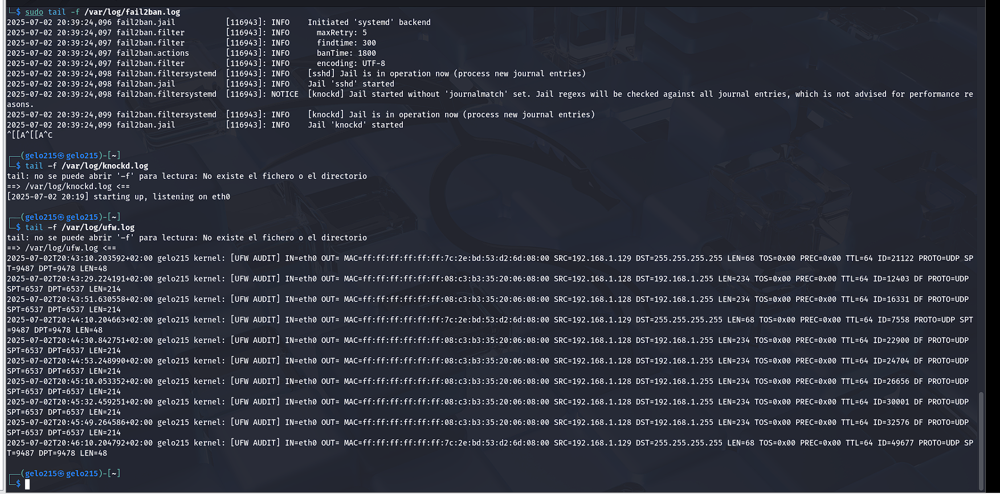

##  Comprobaciones Obligatorias (Resultados del Ejercicio)

Todas las comprobaciones obligatorias del ejercicio se han verificado con éxito:

* [x] SSH solo accesible después de Port Knocking correcto.
* [x] Fail2ban bloquea IPs después de intentos fallidos.
* [x] UFW registra y bloquea tráfico no autorizado.
* [x] Autenticación por clave pública funciona correctamente.
* [x] Banner de advertencia se muestra en conexiones.
* [x] Logs detallados de todas las actividades están disponibles.
* [x] Configuraciones de cifrado fuerte aplicadas en SSH.
* [x] Timeouts y límites de conexión funcionando según lo configurado.

##  Lecciones Aprendidas

Este ejercicio práctico ha sido fundamental para consolidar conocimientos en seguridad de sistemas. Las principales lecciones aprendidas incluyen:

* **Defensa en Profundidad:** La importancia de combinar múltiples capas de seguridad (firewall, hardening, port knocking, detección de intrusiones) para crear una estrategia de defensa robusta.
* **Gestión de la Superficie de Ataque:** Cómo Port Knocking puede ser una herramienta eficaz para reducir la visibilidad de los servicios expuestos, aunque no debe ser la única medida de seguridad.
* **Automatización de la Seguridad:** La utilidad de Fail2Ban para automatizar la respuesta a ataques de fuerza bruta y la importancia de su correcta configuración y monitorización.
* **Principios de Mínimo Privilegio:** La práctica de crear usuarios dedicados para SSH y deshabilitar el acceso `root` directo, además de utilizar autenticación por clave pública para mayor seguridad.
* **Análisis y Depuración:** La experiencia en la configuración y depuración de servicios interconectados ha sido crucial para comprender el flujo de seguridad y resolver problemas.

Este proyecto refuerza la importancia de la seguridad por capas y la implementación de principios de "mínimo privilegio" y "defensa en profundidad" en la administración de sistemas.

## Estado del proyecto
- [x] Terminado
- [ ] En desarrollo
- [ ] En pausa

## Autor
Ángel Mariano Álvarez López  
📧 angelmarianoalvarez@gmail.com