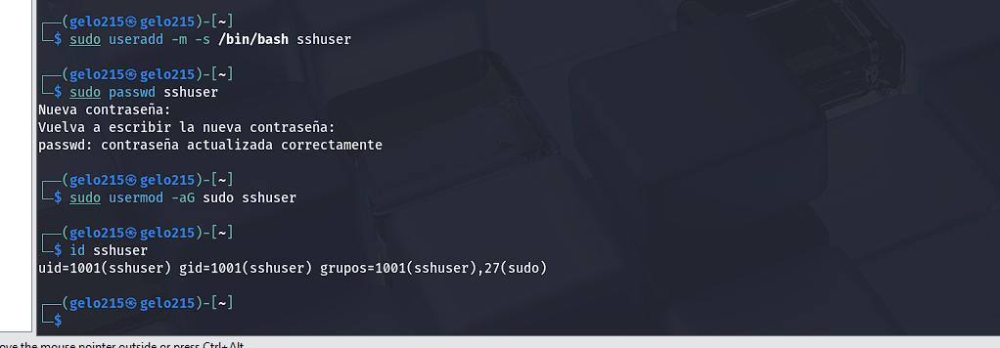
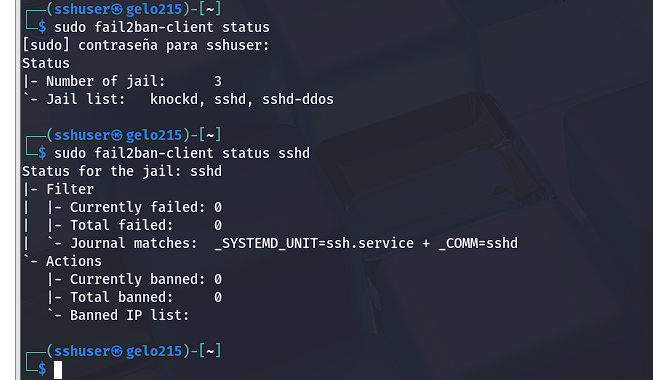
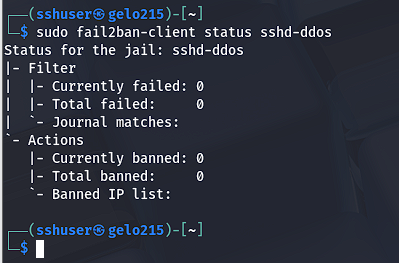

# SSH Seguro y Robusto: Autenticación por Clave Pública, Banner Legal, UFW, Fail2ban y Port Knocking

## 📝 Resumen del Proyecto

Este proyecto detalla la implementación de un entorno SSH (Secure Shell) avanzado y altamente seguro en una máquina Kali Linux. El objetivo principal es fortalecer el acceso remoto al servidor, protegerlo contra ataques comunes y mantener una postura de seguridad proactiva.

**Objetivos clave:**
* Configurar SSH con autenticación robusta mediante clave pública.
* Personalizar el puerto de escucha de SSH para mayor discreción.
* Implementar un banner legal para advertencia y disuasión.
* Configurar `ufw` como cortafuegos para controlar el tráfico.
* Integrar `fail2ban` para mitigar ataques de fuerza bruta.
* Implementar `port knocking` con `knockd` para ocultar el servicio SSH hasta una secuencia específica.

## 🛠️ Tecnologías y Herramientas Utilizadas

* **Sistema Operativo:** Kali Linux
* **Servicio de Acceso Remoto:** OpenSSH Server
* **Cortafuegos:** UFW (Uncomplicated Firewall)
* **Detección y Bloqueo de Intrusiones:** Fail2ban
* **Ocultamiento de Puertos:** Knockd (Port Knocking)
* **Generación de Claves:** SSH-keygen
* **Cliente SSH (Windows):** PuTTY

## 🚀 Paso a Paso de la Implementación

### FASE 1: Preparación e Instalación de Software Base

Se actualizó el sistema y se instalaron los paquetes esenciales para el proyecto: `openssh-server`, `ufw`, `fail2ban` y `knockd`.

* **Captura:** Instalación de Software Base.
    

* **Captura:** Dirección IP del servidor Kali (fundamental para la conexión remota).
    

* **Captura:** Creación del usuario dedicado para SSH (`sshuser`).
    

### FASE 2: Hardening del Servicio SSH

Se realizaron configuraciones clave en el archivo `/etc/ssh/sshd_config` para fortalecer el servicio SSH:

* **Paso 1: Configuración básica del servicio SSH**
    Se ha editado `/etc/ssh/sshd_config` para:
    * Desactivar el login con contraseña (`PasswordAuthentication no`).
    * Cambiar el puerto por defecto a `2222`.
    * Deshabilitar `ChallengeResponseAuthentication`.
    * Incluir el archivo del banner legal (`Banner /etc/issue.net`).

    > ⚠️ **Nota sobre el puerto:** Aunque lo ideal sería usar un puerto superior al 10000 para dificultar su detección mediante escaneos simples (como indicó el profesor), este ejercicio se centra en cambiar el puerto para demostrar la funcionalidad.

    **Captura:** Configuración Inicial de `sshd_config` (Puerto 2222, `PasswordAuthentication no`).
    

* **Paso 2: Configuración avanzada de `/etc/ssh/sshd_config`**
    Se aplicaron ajustes adicionales para mejorar la seguridad y la gestión de sesiones:
    * Configuración de tiempos de actividad para desconectar sesiones inactivas (`ClientAliveInterval`, `ClientAliveCountMax`).
    * Otras optimizaciones de seguridad (como `UsePAM no`, `X11Forwarding no`, etc., si se aplicaron).

    **Captura:** Configuración SSH Avanzada (parámetros adicionales de seguridad y sesión).
    

* **Paso 3: Creación del banner legal**
    Se creó el archivo `/etc/issue.net` con un mensaje de advertencia legal que se mostrará a los usuarios al intentar conectarse.

    **Captura:** Contenido del Banner Legal.
    

* **Paso 4: Generación de claves SSH y permisos**
    Se generaron pares de claves SSH (pública y privada) para el `sshuser`, asegurando que la autenticación se realice por clave y no por contraseña.

    **Captura:** Proceso de Generación de Claves SSH (`ssh-keygen`).
    

* **Paso 5: Verificación del estado del servicio SSH**
    Se confirmó que el servicio SSH (`sshd`) se está ejecutando correctamente después de las modificaciones y reinicios.

    **Captura:** Estado del Servicio SSH.
    

### FASE 3: Configuración del Cortafuegos UFW

Se configuraron las reglas de UFW para permitir la conexión SSH solo de forma dinámica a través de Port Knocking.

* **Paso 1: Configuración inicial de UFW**
    Se establecieron las políticas por defecto y se aseguraron los permisos. **Importante:** el puerto `2222` no debe estar explícitamente abierto de forma permanente en UFW para que el Port Knocking funcione correctamente.

    **Captura:** Reglas de UFW (mostrando el puerto SSH no abierto permanentemente).
    

* **Paso 2: Verificación de correcciones**
    Se realizó una verificación de las reglas aplicadas en UFW.

    **Captura:** Correcciones y Reglas de UFW.
    

### FASE 4: Configuración de Fail2ban

Se configuró Fail2ban para proteger el servicio SSH contra ataques de fuerza bruta, bloqueando las IPs que intenten repetidamente iniciar sesión sin éxito.

* **Paso 1: Configuración de `jail.local`**
    Se personalizó `/etc/fail2ban/jail.local` para configurar el jail `sshd`, especificando el puerto `2222`, el tiempo de baneo (`bantime`) y el número de reintentos (`maxretry`).

    **Captura:** Archivo de Configuración de Fail2ban (`jail.local`).
    

* **Paso 2: Verificación del estado de Fail2ban**
    Se confirmó que el jail `sshd` de Fail2ban está activo y monitoreando el servicio SSH.

    **Captura:** Estado del Servicio Fail2ban.
    

### FASE 5: Configuración de Port Knocking con `knockd`

Se implementó `knockd` para que el puerto SSH (`2222`) permanezca oculto y solo se abra tras recibir una secuencia específica de "golpes" a puertos predefinidos.

* **Paso 1: Configuración de `knockd` en `/etc/default/knockd`**
    Se habilitó el inicio de `knockd` con el sistema.

    **Captura:** Configuración de Inicio de Knockd.
    

* **Paso 2: Configuración de secuencias en `/etc/knockd.conf`**
    Se definieron las secuencias de puertos para "abrir" y "cerrar" el puerto SSH, junto con las acciones de UFW asociadas a cada secuencia.

    **Captura:** Configuración de `knockd.conf` (Secuencias de Puertos y Acciones UFW).
    

### FASE 6: Verificación y Pruebas del Entorno Seguro

Se realizaron pruebas exhaustivas para confirmar que todas las medidas de seguridad funcionan como se espera.

* **Paso 1: Verificación de estados generales**
    Se realizaron comprobaciones adicionales del estado de los servicios.

    **Captura:** Verificación de Estados de Servicios.
    

* **Paso 2: Conexión desde cliente SSH local tras port knocking**
    Se demostró el funcionamiento del Port Knocking:
    1.  `nmap` inicial mostrando el puerto `2222` como **filtrado/cerrado**.
    2.  Ejecución de la secuencia de `knock` para abrir el puerto.
    3.  `nmap` posterior mostrando el puerto `2222` como **abierto**.
    4.  Conexión SSH exitosa al puerto `2222`.
    5.  (Idealmente) Ejecución de la secuencia de `knock` para cerrar el puerto.
    6.  (Idealmente) `nmap` final mostrando el puerto `2222` como **filtrado/cerrado** de nuevo.

    **Captura:** Demostración del Port Knocking y Conexión SSH Local Exitosa.
    

* **Paso 3: Conexión desde cliente externo (Windows + PuTTY)**
    Se validó la conexión SSH desde un sistema operativo diferente (Windows) utilizando PuTTY, confirmando que el banner legal se muestra y que la autenticación por clave funciona.

    **Captura:** Conexión Exitosa desde Windows con PuTTY (mostrando el banner).
    

## 💡 Conclusión y Aprendizajes Clave

Este proyecto ha permitido implementar y comprender un conjunto robusto de técnicas de seguridad para el acceso SSH, cruciales en cualquier entorno de red.

**Aprendizajes clave:**
* **Hardening SSH:** La importancia de ir más allá del puerto por defecto, deshabilitar métodos de autenticación débiles (contraseña, root directo) y usar claves públicas.
* **Cortafuegos (`ufw`):** La base para controlar el tráfico de red, permitiendo solo lo estrictamente necesario y trabajando en conjunto con otras herramientas.
* **Fail2ban:** Un sistema eficaz para automatizar la defensa contra ataques de fuerza bruta, analizando logs y bloqueando automáticamente IPs maliciosas.
* **Port Knocking (`knockd`):** Una capa de seguridad adicional que oculta un servicio, haciéndolo invisible hasta una secuencia de "golpes" correcta. Permite un acceso dinámico y sigiloso.
* **Integración de Seguridad:** La eficacia de combinar múltiples herramientas (SSH, UFW, Fail2ban, Knockd) para crear una defensa en profundidad, donde cada capa complementa a las demás.
* **Resolución de Problemas:** La experiencia de depurar y superar desafíos de configuración (como el problema anterior con el puerto de `nmap`) ha sido fundamental para consolidar el conocimiento y demostrar la capacidad de análisis.

Este proyecto refuerza la importancia de la seguridad por capas y la implementación de principios de "mínimo privilegio" y "defensa en profundidad" en la administración de sistemas.

---

**Consideraciones para tu portfolio:**

* **Actualiza los nombres de archivo de las capturas:** Recuerda asegurarte de que todas tus capturas físicas en tu repositorio (GitHub, etc.) tengan la extensión `.png` (ej., `Captura_Archivo_Fail2ban.png` en lugar de `.jpg`).
* **Revisa tus capturas de prueba:** Para los pasos 6 (Reglas UFW), 11 (Conexión local) y 12 (Conexión Windows), asegúrate de que las capturas muestren el comportamiento esperado del Port Knocking (puerto cerrado -> knocks -> puerto abierto -> conexión). Si es necesario, divide el Paso 11 en 2 o 3 capturas para mostrar todo el flujo de `nmap`/`knock`/`nmap`.
* **Considera un GIF:** Para el Port Knocking, un GIF animado mostrando la secuencia `nmap -> knock -> nmap` sería increíblemente visual y demostrativo.

Este `README.md` es mucho más completo y profesional. ¡Espero que te sea de gran utilidad para tu portfolio!