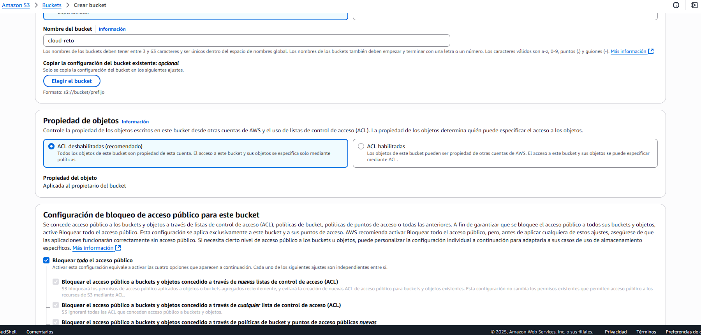
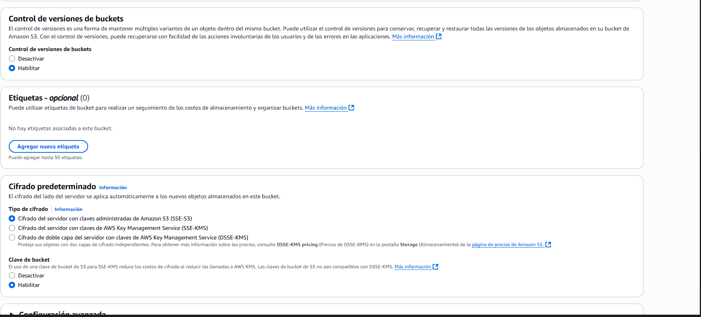
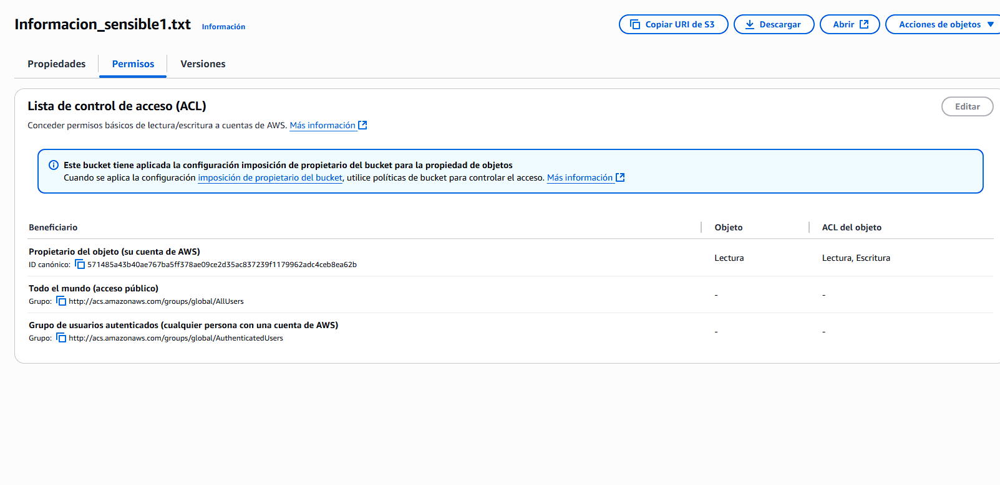
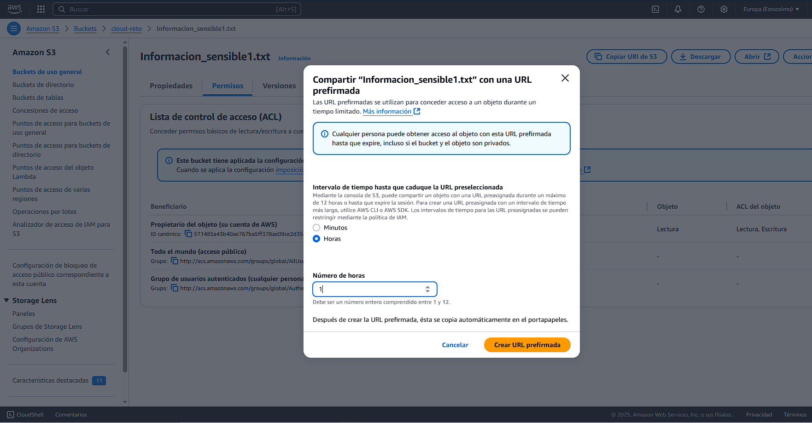
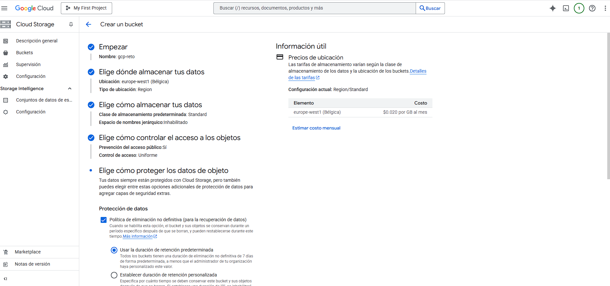
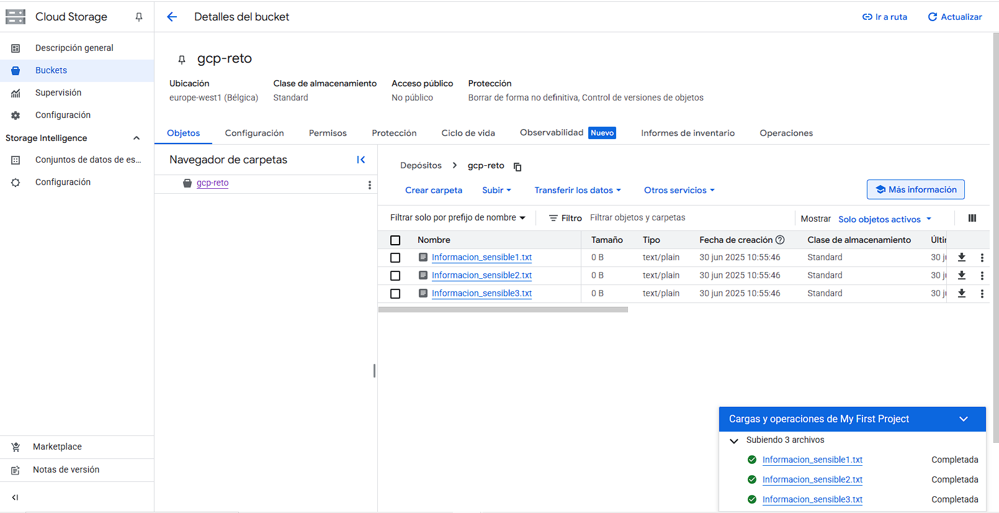
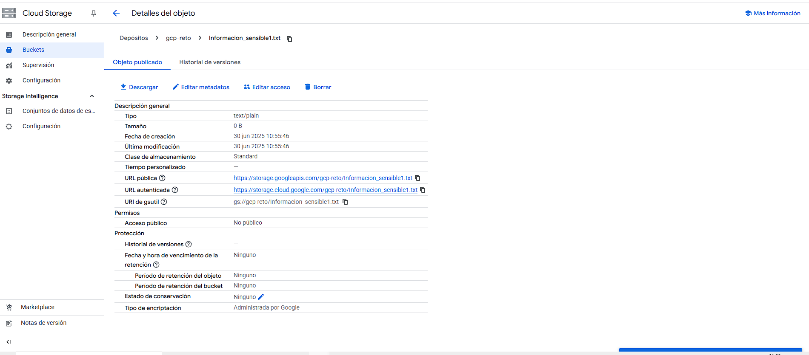

# Reto de Almacenamiento Seguro en la Nube (AWS S3 y Google Cloud Storage)

## Descripción del Proyecto
Este proyecto documenta la resolución del **"Reto 3: Almacenar y Recuperar Archivos en S3 y Google Cloud Storage"** del curso de **Servicios Cloud (FUNDAE)**. El objetivo fue implementar soluciones de almacenamiento seguras y controladas en las plataformas de Amazon Web Services (AWS) y Google Cloud Platform (GCP).

El enfoque principal de este reto ha sido la **seguridad por diseño**, asegurando que los datos almacenados ("información sensible") permanezcan privados y solo sean accesibles de forma controlada y temporal, demostrando la aplicación de principios como el mínimo privilegio y la gestión segura de enlaces compartidos.

## Desafío y Tareas Realizadas

El reto consistió en establecer un "santuario seguro" para archivos valiosos en la nube, lo que implicó las siguientes tareas, con un enfoque prioritario en la seguridad:

1.  **Creación de Buckets Seguros:**
    * Se crearon buckets tanto en AWS S3 (`cloud-reto`) como en Google Cloud Storage (`gcp-reto`).
    * **Enfoque de Seguridad:** Se aseguraron configuraciones **privadas y cifradas** desde el inicio, bloqueando explícitamente todo acceso público y activando el cifrado en reposo. Se habilitó el control de versiones en AWS S3 para resiliencia ante borrados o modificaciones accidentales.

2.  **Almacenamiento de Archivos Sensibles:**
    * Se cargaron "archivos sensibles" (denominados `informacion_sensible1.txt`, `informacion_sensible2.txt`, `informacion_sensible3.txt`) en ambos buckets.

3.  **Configuración de Permisos de Acceso Estricto:**
    * Se configuraron los permisos para garantizar que los archivos permanecieran privados.
    * **Enfoque de Seguridad:** Se aplicó el **principio de mínimo privilegio**, asegurando que el acceso fuera estrictamente controlado y no público, utilizando las políticas de bucket y la gestión de acceso uniforme en GCP.

4.  **Generación de Enlaces Seguros y Temporales:**
    * Se generaron enlaces de acceso para compartir la información con "aliados confiables" de forma segura.
    * **Enfoque de Seguridad:**
        * En **AWS S3**, se generó una **URL pre-firmada** con una caducidad de **1 hora**, demostrando la capacidad de proporcionar acceso temporal y controlado.
        * En **Google Cloud Storage**, se utilizó la **URL autenticada** del objeto, confirmando que el acceso no es público y requiere autenticación y permisos explícitos.

## Tecnologías y Habilidades Clave
* **Servicios Cloud:** Amazon Web Services (AWS), Google Cloud Platform (GCP).
* **Almacenamiento en la Nube:** AWS S3 (Simple Storage Service), Google Cloud Storage.
* **Seguridad en la Nube:**
    * **Bloqueo de Acceso Público:** Configuración de buckets y objetos como privados.
    * **Cifrado de Datos en Reposo:** Activación y verificación de la encriptación del lado del servidor.
    * **Control de Versiones:** Uso para resiliencia y recuperación de datos.
    * **Principio de Mínimo Privilegio:** Aplicación de permisos restrictivos.
    * **Generación de URLs Seguras:** Creación de enlaces temporales (AWS S3 Pre-signed URLs) o URLs autenticadas (GCP).
* **Gestión de Consolas Cloud:** Navegación y operación en las interfaces de AWS y GCP.

## Evidencia del Proyecto
Aquí se incluyen las capturas de pantalla que validan la implementación y las configuraciones de seguridad:

### AWS S3
* **Creación del Bucket y Bloqueo de Acceso Público:**
    * 
* **Cifrado y Control de Versiones:**
    * 
* **Verificación de Permisos (No Público):**
    * 
* **Generación de URL Pre-firmada (1 Hora):**
    * 

### Google Cloud Storage
* **Creación del Bucket y Control de Acceso Uniforme:**
    * 
* **Archivos Almacenados:**
    * 
* **Verificación de Permisos y URL Autenticada (No Público):**
    * 

## Estado del Proyecto
* [x] Reto completado satisfactoriamente.
* [x] Implementación y configuración verificadas en AWS y GCP.
* [x] Medidas de seguridad aplicadas y documentadas.

## Autor
Ángel Mariano Álvarez López  
 📧 angelmarianoalvarez@gmail.com
