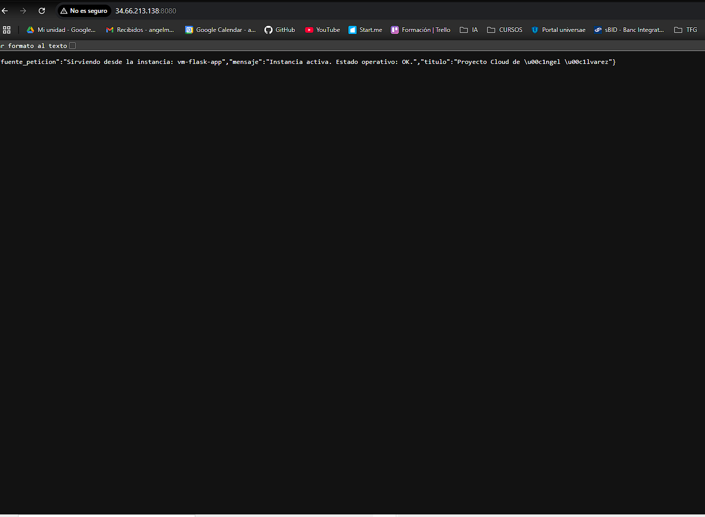
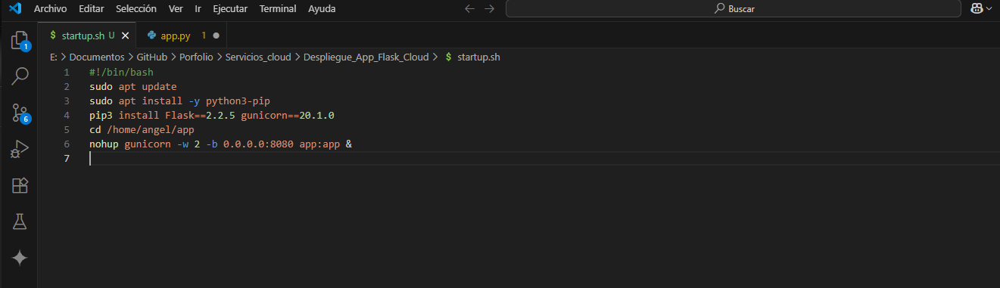
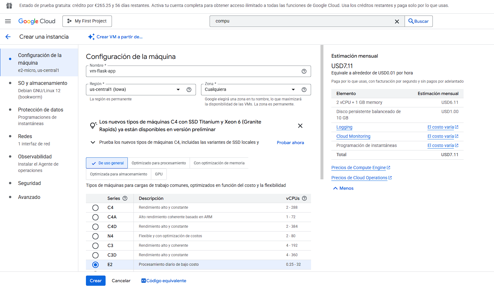
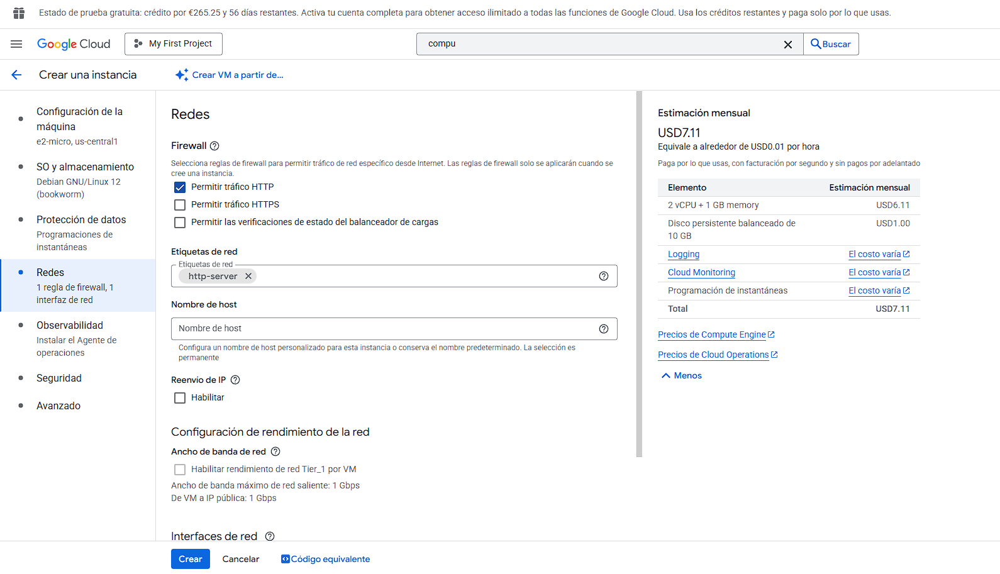
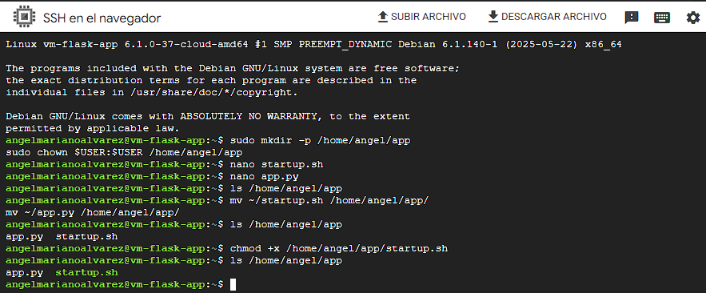
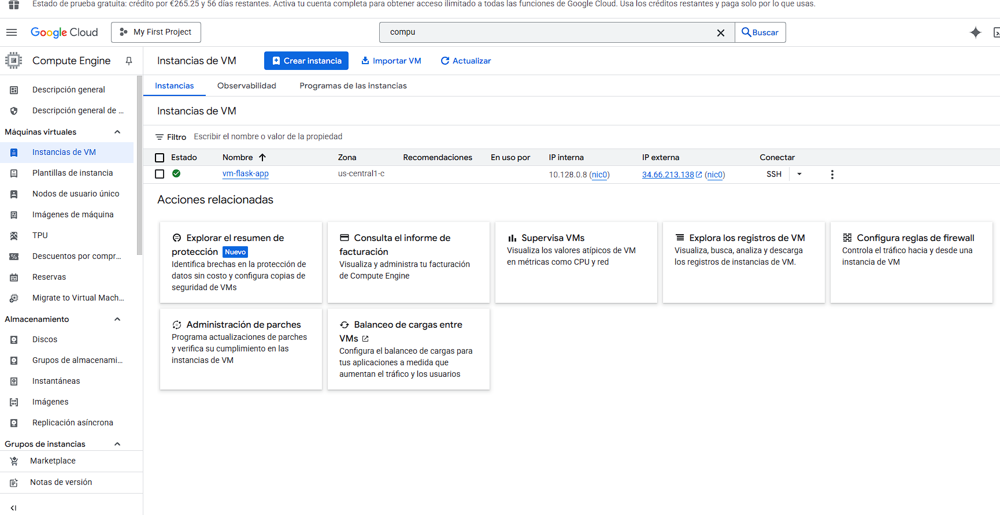
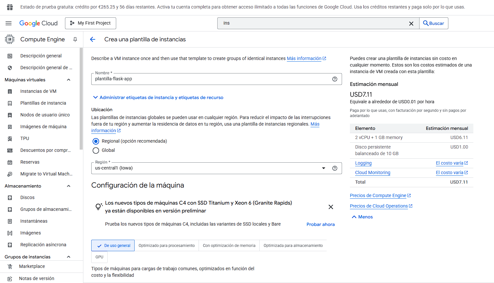
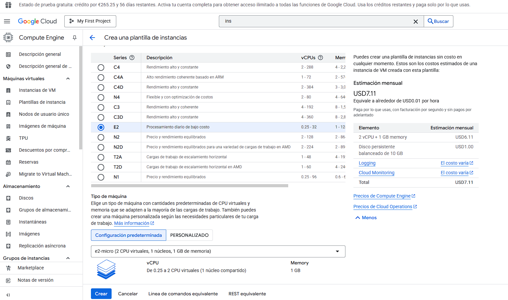
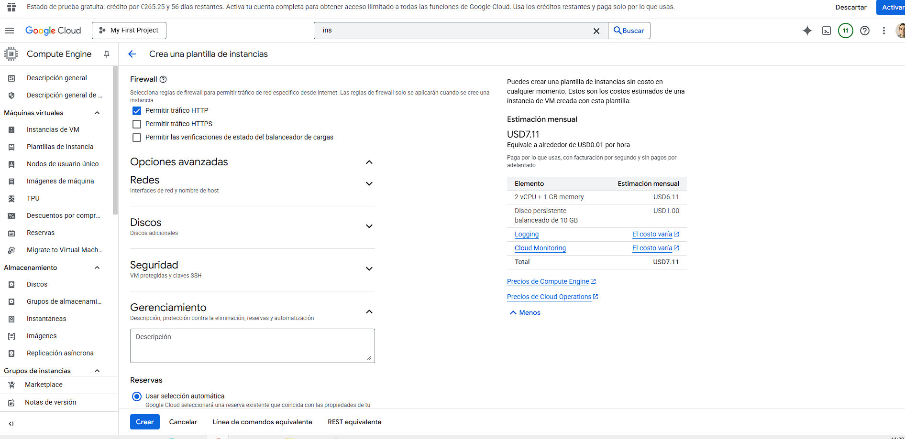
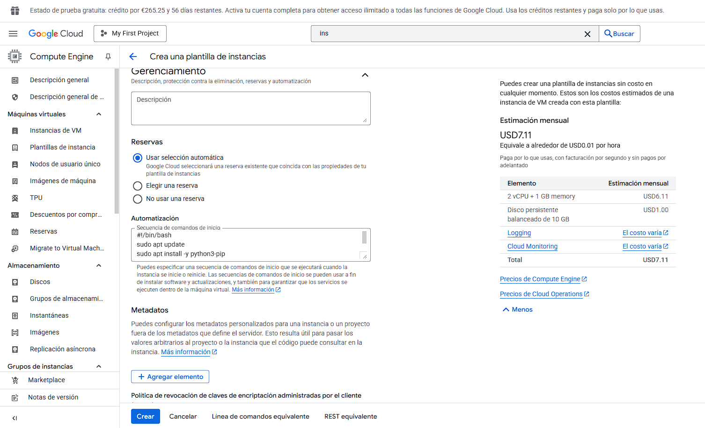

# Despliegue Automatizado de una Aplicación Flask en Google Cloud

## Descripción del Proyecto

Este proyecto demuestra el proceso de despliegue automatizado de una aplicación web desarrollada con Python y Flask en una máquina virtual de **Google Cloud Platform (GCP)**.

El objetivo principal es encapsular toda la configuración e instalación de dependencias dentro de una **Plantilla de Instancia (Instance Template)**, permitiendo la creación rápida y consistente de nuevos servidores listos para funcionar sin intervención manual. Este documento no solo muestra el resultado final, sino que también sirve como un apéndice detallado del proceso.

---

## Arquitectura y Proceso

El despliegue se basa en los siguientes componentes clave de GCP:

1.  **Aplicación Flask:** Una aplicación web simple que sirve como carga de trabajo.
2.  **Startup Script:** Un script de shell (`startup.sh`) que automatiza todas las tareas de configuración del servidor.
3.  **Compute Engine VM:** Una máquina virtual `e2-micro` basada en Debian que aloja la aplicación.
4.  **Plantilla de Instancia:** El "molde" que contiene toda la configuración de la VM, permitiendo despliegues replicables.

---

## Tecnologías Utilizadas
* Google Cloud Platform (GCP)
* Python (con Flask)
* Gunicorn
* Git y GitHub
* Linux (Debian)
* SSH

---
## Mejoras Futuras (Retos 8 y 9)

Este proyecto sienta las bases para futuras mejoras que implementarían una arquitectura de alta disponibilidad y escalabilidad:
* **Crear un Grupo de Instancias Gestionado (MIG):** Usar la plantilla creada para desplegar y gestionar múltiples instancias.
* **Configurar el Autoescalado:** Añadir una política de autoescalado al MIG para que responda a los cambios en la carga.
* **Implementar un Balanceador de Carga:** Configurar un Balanceador de Carga para distribuir el tráfico entre las instancias.

---
## Apéndice: Proceso Detallado de Despliegue

A continuación, se documenta el proceso detallado llevado a cabo para lograr el despliegie.

### 1. Creación del Script de Automatización (`startup.sh`)
El primer paso fue crear un script de shell para automatizar toda la configuración del servidor. Este script se encarga de instalar las dependencias y lanzar la aplicación con Gunicorn en el puerto 8080.

### 2. Creación de una Instancia de VM de Prueba
Para validar el proceso, primero se desplegó una única máquina virtual (`vm-flask-app`).

* **Configuración general de la instancia:**

* **Configuración del Firewall y Red:** Se permitió el tráfico HTTP para aplicar la etiqueta `http-server`.

### 3. Verificación y Ejecución Manual
Se accedió por SSH a la instancia para verificar la subida de archivos y ejecutar el script manualmente, validando su funcionamiento.

* **Verificación de archivos en el servidor:**

* **Ejecución manual del script de inicio:**

* **Instancia creada y con IP pública asignada:**

### 4. Creación de la Plantilla de Instancia (Automatización Final)
Con el método validado, se procedió a crear una Plantilla de Instancia para automatizar el proceso.

* **Nombre y Región de la Plantilla:**

* **Selección del Tipo de Máquina (`e2-micro`):**

* **Configuración del Firewall en la Plantilla:**

* **Inclusión del Script de Inicio en la Plantilla:**

### 5. Verificación Final en el Navegador
El resultado final es el despliegue exitoso de la aplicación, accesible a través de su IP pública en el puerto 8080.

## Estado del Proyecto

- [x] Proyecto Finalizado
- [x] Validado el funcionamiento desde navegador
- [x] Limpieza de recursos (instancias, plantillas, grupos)

## Autor

Ángel Mariano Álvarez López  
📧 angelmarianoalvarez@gmail.com  
🔗 [GitHub Porfolio](https://github.com/Angel-Mariano-Alvarez/Porfolio)

