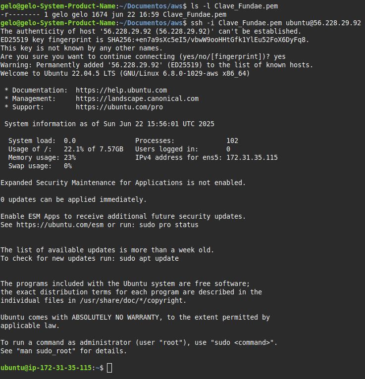

# Despliegue_Instancia_EC2_AWS

## Descripción

Este ejercicio tiene como objetivo desplegar una instancia de Ubuntu 22.04 en Amazon Web Services (AWS), crear un grupo de seguridad adecuado para su acceso remoto y establecer una conexión SSH desde el terminal local utilizando una clave privada `.pem`. Esta práctica corresponde al curso **Servicios Cloud** de FUNDAE.

## Fase 1 – Crear una instancia EC2

- Se accede al panel de EC2 desde la consola de AWS.
- Se crea una nueva instancia seleccionando **Ubuntu Server 22.04 LTS (HVM), SSD Volume Type – 64 bits x86**.
- Se asigna un par de claves existente (`Clave_Fundae.pem`) y se genera la configuración de red y almacenamiento por defecto.

## Fase 2 – Configuración del grupo de seguridad

Durante la creación de la instancia se define un nuevo **grupo de seguridad** personalizado con las siguientes reglas:

### Reglas de entrada

| Tipo         | Protocolo | Puerto | Origen      |
|--------------|-----------|--------|-------------|
| SSH          | TCP       | 22     | Mi IP       |

> ⚠️ Se limita el acceso SSH únicamente a la IP actual desde la cual se lanza la instancia. Esta es una práctica recomendada para evitar accesos no autorizados.

### Reglas de salida

| Tipo         | Protocolo | Puerto | Destino     |
|--------------|-----------|--------|-------------|
| Todos        | Todos     | Todos  | 0.0.0.0/0   |

> Esta configuración permite que la instancia realice conexiones hacia el exterior sin restricciones, útil para actualizaciones o instalación de software.

## Fase 3 – Conexión mediante SSH

### Paso 1: Asignar permisos seguros a la clave privada

```bash
ls -l Clave_Fundae.pem
chmod 400 Clave_Fundae.pem
```

> El permiso `400` garantiza que solo el propietario del archivo pueda leer la clave, lo cual es obligatorio para conexiones SSH en Linux.

### Paso 2: Establecer la conexión SSH

```bash
ssh -i Clave_Fundae.pem ubuntu@<IP_PUBLICA>
```

> Se sustituye `<IP_PUBLICA>` por la dirección IPv4 de la instancia desplegada.

### Resultado:

¡Conexión exitosa! A continuación, la evidencia visual de la terminal:



---

## Fase 4 – Desactivar la autenticación por contraseña (Hardening básico)

Una vez conectados a la instancia, se recomienda reforzar la seguridad SSH desactivando el inicio de sesión por contraseña:

### Paso 1: Editar el archivo de configuración SSH

```bash
sudo nano /etc/ssh/sshd_config
```

Buscar y modificar las siguientes líneas:

```
PasswordAuthentication no
PermitRootLogin no
```

> Esto evita que cualquier usuario intente autenticarse usando contraseña y desactiva el acceso del usuario root directamente.

### Paso 2: Reiniciar el servicio SSH para aplicar los cambios

```bash
sudo systemctl restart ssh
```


## Conclusiones

- La instancia fue desplegada y conectada correctamente.
- El grupo de seguridad fue configurado siguiendo buenas prácticas básicas.
- La clave privada fue asegurada para cumplir con los requisitos de SSH.
- Se realizó una mejora de seguridad al desactivar el acceso por contraseña.
- Este tipo de despliegue es la base para entornos más avanzados (Docker, webapps, monitorización…).

---

📁 Proyecto desarrollado dentro del curso **Servicios Cloud (FUNDAE)**  
📧 angelmarianoalvarez@gmail.com
