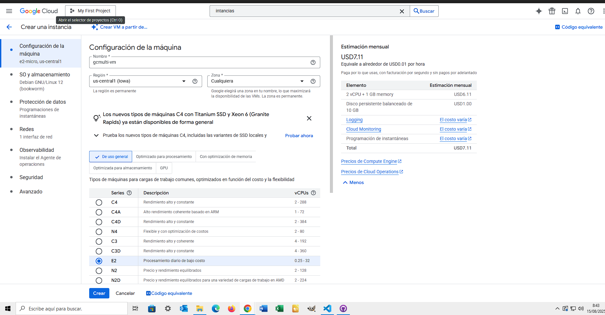
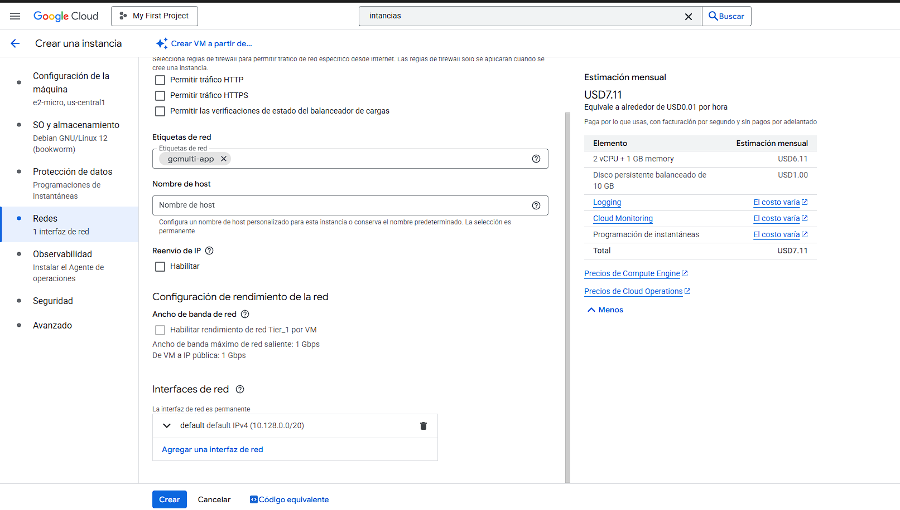
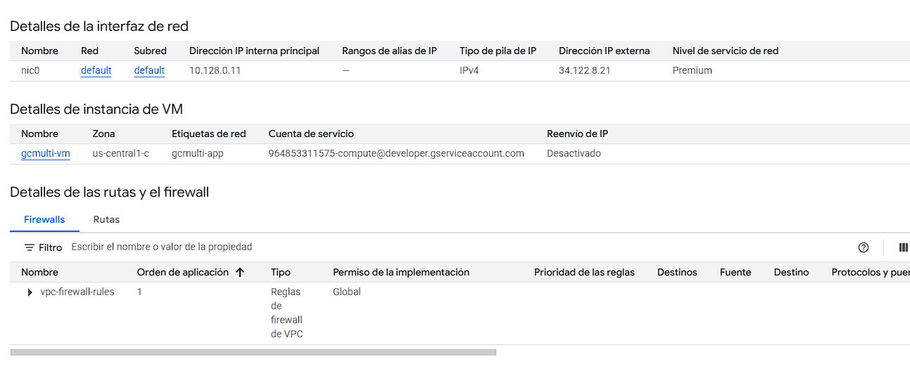
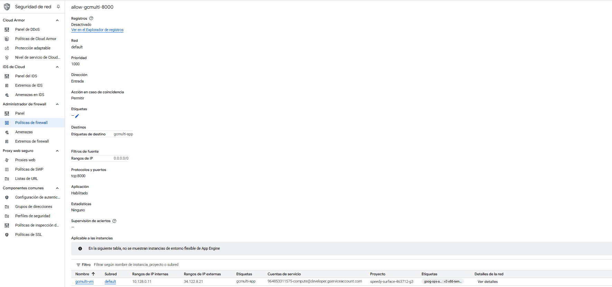
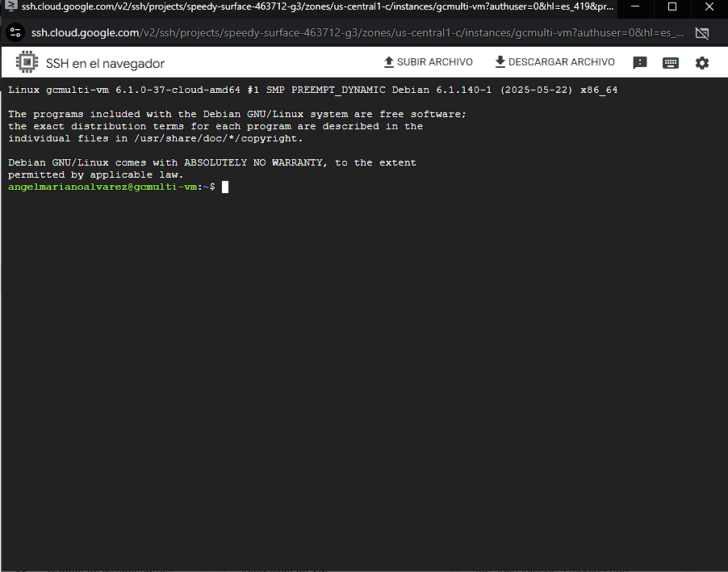
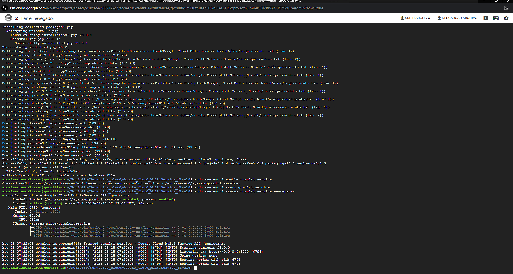
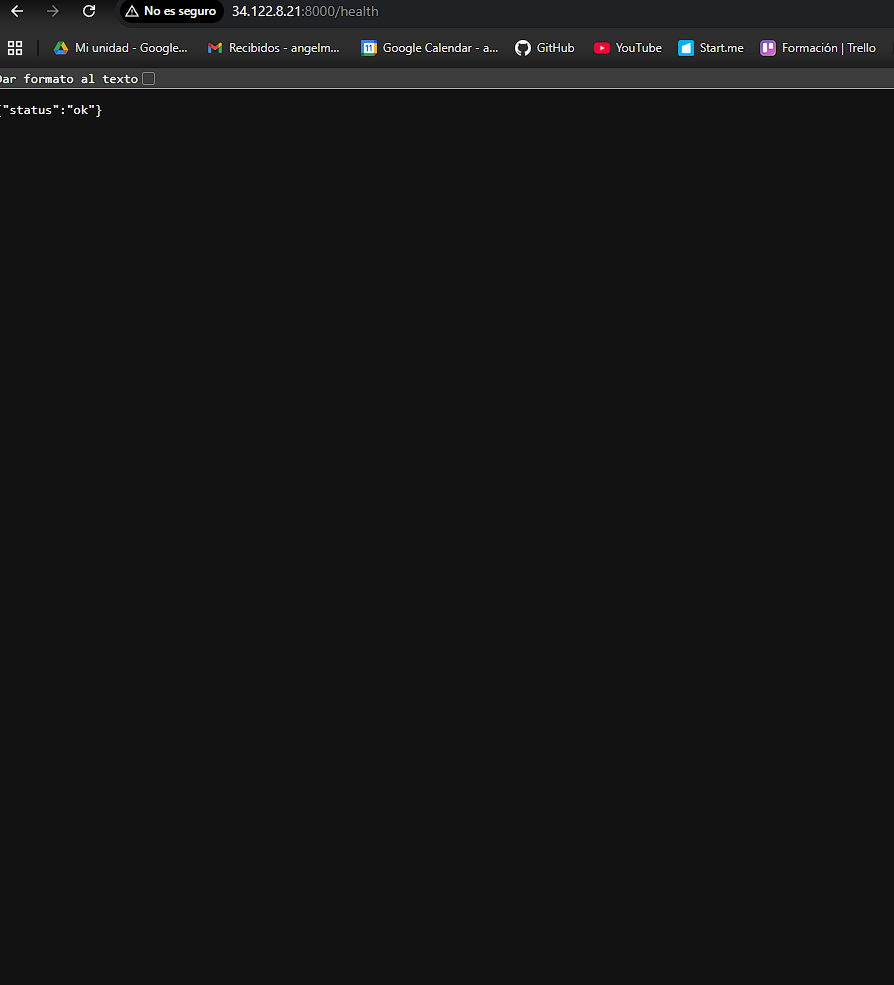
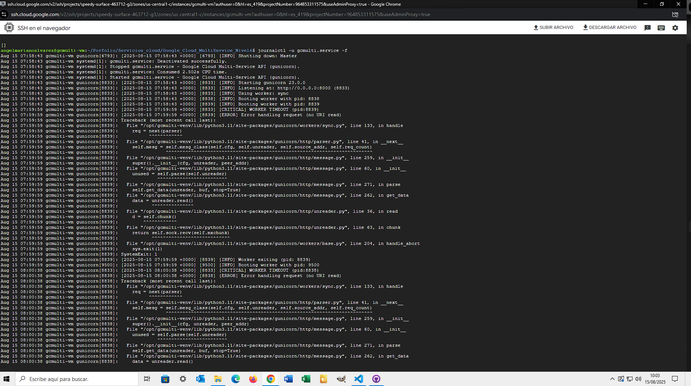
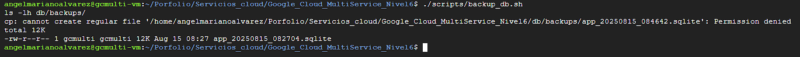

# Google Cloud Multi-Service – Nivel 6 Edition

Este proyecto corresponde a un reto unificado del **Nivel 6** del curso de Servicios Cloud.  
Se ha desplegado una API en Flask con base de datos SQLite sobre una **VM e2-micro** de Google Cloud Platform (GCP) dentro del free tier,  
con configuración de firewall, servicio `systemd`, backup y pruebas de funcionamiento documentadas paso a paso.

## 📋 Objetivos
- Desplegar una API en Flask accesible externamente en GCP.
- Configurar una base de datos SQLite inicializada con el esquema definido.
- Implementar seguridad básica mediante regla de firewall con etiqueta de red.
- Gestionar el servicio con `systemd` para ejecución en segundo plano.
- Incorporar scripts para inicializar la BD (`init_db.sh`) y generar backups (`backup_db.sh`).
- Documentar todo el proceso con capturas para el porfolio.

---

## 1️⃣ Selección de proyecto en GCP
Se selecciona el proyecto en la consola de Google Cloud y se habilita Compute Engine.



---

## 2️⃣ Creación de la VM e2-micro
Se crea una instancia `gcmulti-vm` con:
- Serie: **E2**
- Tipo: **e2-micro** (free tier)
- SO: **Debian 12 (bookworm)**
- Disco: 10 GB estándar
- Etiqueta de red: `gcmulti-app`



---

## 3️⃣ Detalle de la VM
Vista de la instancia creada, con IP externa y etiqueta de red configurada.



---

## 4️⃣ Regla de firewall
Se crea la regla `allow-gcmulti-8000` para permitir tráfico TCP entrante al puerto **8000** desde `0.0.0.0/0` solo para instancias con la etiqueta `gcmulti-app`.



---

## 5️⃣ Conexión SSH
Se accede a la VM mediante la conexión SSH desde el navegador.



---

## 6️⃣ Despliegue y estado del servicio
Se clona el repositorio, se otorgan permisos de ejecución a los scripts y se ejecuta `deploy.sh`.  
Se habilita y arranca el servicio `gcmulti.service`, confirmando que está **active (running)**.



---

## 7️⃣ Prueba de la API – Endpoint `/health`
Se accede desde el navegador a la IP pública y puerto 8000, confirmando respuesta JSON `{"status":"ok"}`.



---

## 8️⃣ Logs en vivo
Se visualizan los logs del servicio con `journalctl -u gcmulti.service -f` mientras se realizan peticiones al endpoint `/items`.



---

## 9️⃣ Backup de la base de datos
Ejecución del script `backup_db.sh` que se auto-relanza como usuario `gcmulti` para generar una copia de la base de datos en `db/backups/`.



---

## 📂 Estructura del proyecto
```
Google_Cloud_MultiService_Nivel6/
│
├── docs/capturas/                # Evidencias gráficas
├── db/
│   ├── schema.sql                # Esquema inicial de la BD
│   ├── app.sqlite                 # Base de datos (generada en la VM)
│   └── backups/                   # Copias de seguridad
├── scripts/
│   ├── deploy.sh                  # Despliegue inicial y configuración systemd
│   ├── init_db.sh                 # Inicialización de la BD como usuario de servicio
│   └── backup_db.sh               # Copia de seguridad de la BD
└── src/
    ├── api.py                     # API Flask
    └── requirements.txt           # Dependencias Python
```

---

## 🛠️ Tecnologías usadas
- **Google Compute Engine** – Máquina virtual e2-micro (free tier)
- **Flask** – Framework para la API
- **SQLite** – Base de datos embebida
- **systemd** – Gestión del servicio
- **Google VPC Firewall** – Control de acceso a la instancia

---

## 🐞 Solución de problemas
### Acceso externo bloqueado
- Revisar la regla de firewall:  
  - **Rangos de IPv4 de origen** debe ser `0.0.0.0/0`  
  - **Etiqueta de destino** debe coincidir con la de la VM (`gcmulti-app`)

### Error `attempt to write a readonly database`
- Verificar permisos de la carpeta `db/` y su contenido:
  ```bash
  sudo chown -R gcmulti:gcmulti db
  ```
- Inicializar la BD con `scripts/init_db.sh`

### Error en backups por permisos
- Asegurarse de usar el `backup_db.sh` mejorado que se auto-relanza como `gcmulti`.

---

## 🧹 Limpieza de recursos
Para evitar costes, al finalizar:
1. Parar el servicio:
   ```bash
   sudo systemctl stop gcmulti.service
   sudo systemctl disable gcmulti.service
   ```
2. Eliminar la VM `gcmulti-vm` desde la consola de GCP.
3. Borrar la regla de firewall `allow-gcmulti-8000`.

---

## Estado del Proyecto
- [x] Proyecto Finalizado
- [x] Validado el funcionamiento 
- [x] Limpieza de recursos pendiente al cierre

---

## Autor
Ángel Mariano Álvarez López  
📧 angelmarianoalvarez@gmail.com  
🔗 [GitHub Porfolio](https://github.com/Angel-Mariano-Alvarez/Porfolio)
