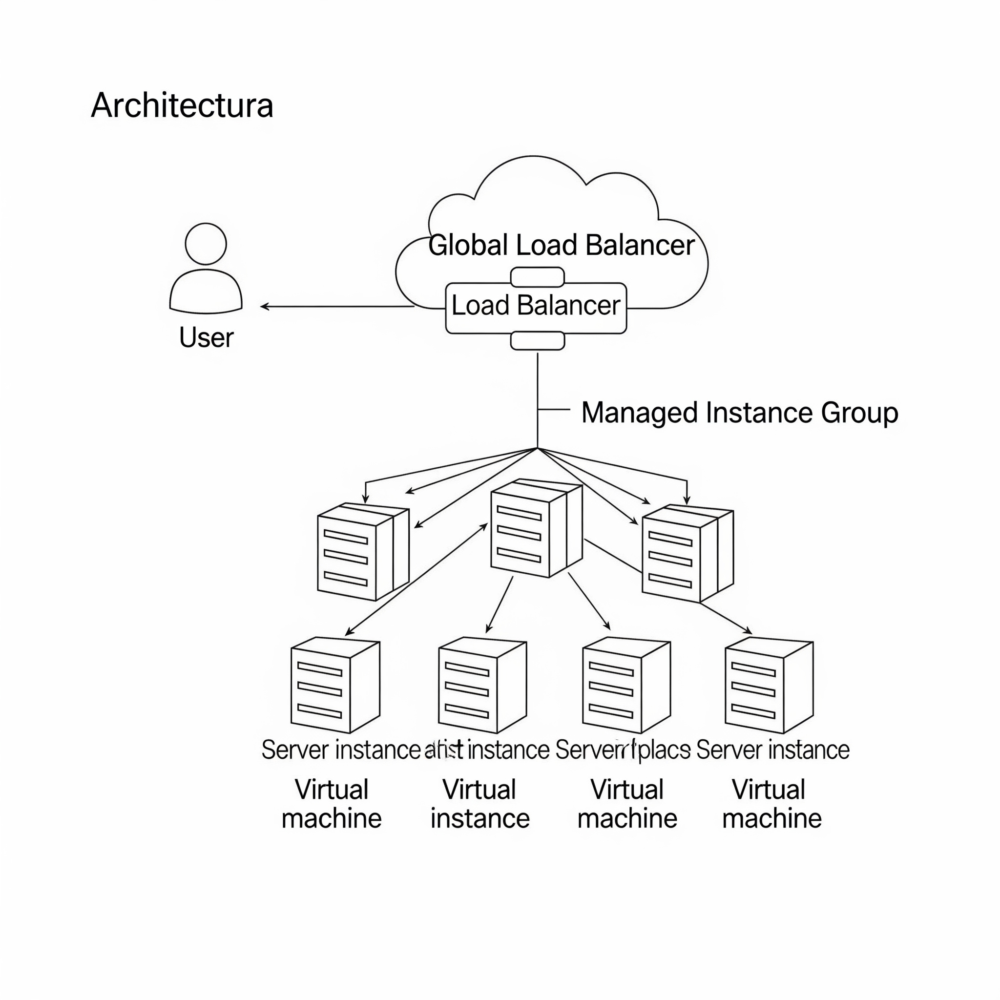
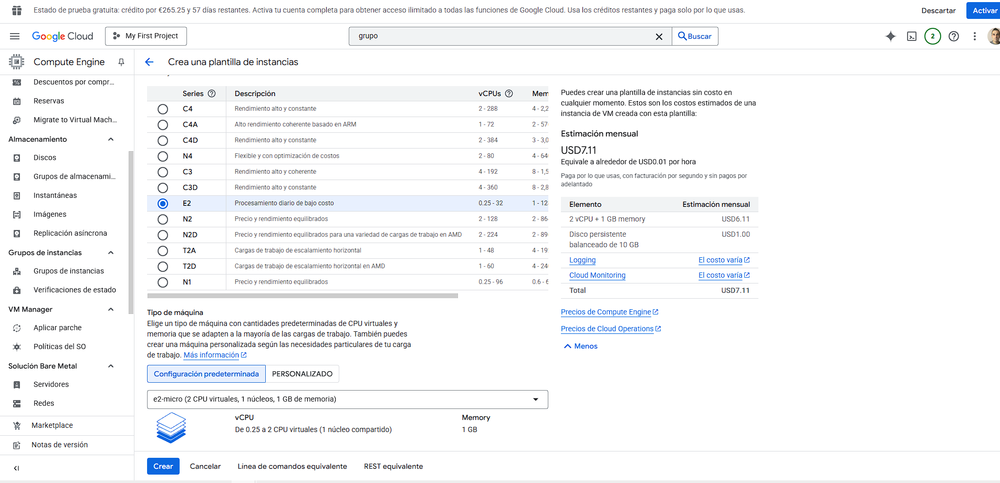
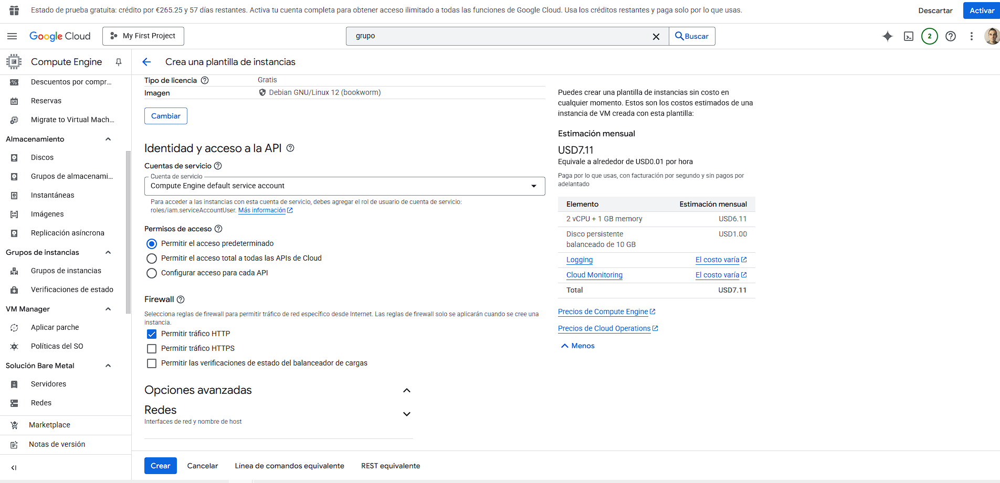
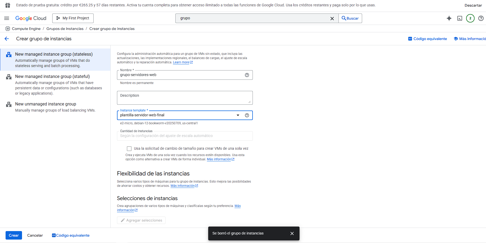
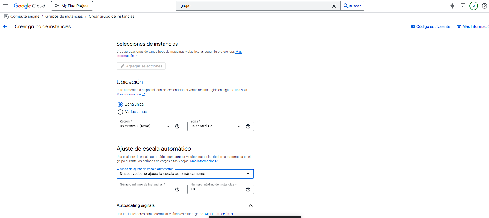

# Diseño de una Aplicación Web Escalable y Resiliente en GCP

Este proyecto documenta el proceso de diseño e implementación de una aplicación web básica en Google Cloud Platform, con un enfoque en la automatización, la escalabilidad y la alta disponibilidad. El proyecto sirve como un estudio de caso práctico sobre el diagnóstico y la resolución de problemas en un entorno de nube realista.

---

## Arquitectura Propuesta

El objetivo final del proyecto es desplegar la aplicación siguiendo una arquitectura moderna y resiliente, compuesta por un balanceador de carga global que distribuye el tráfico a un grupo de instancias administrado y autoescalable.

---

## Tecnologías Utilizadas
* Google Cloud Platform (GCP)
* Python (con Flask)
* Gunicorn
* Git y GitHub
* Linux (Debian)
* SSH y Herramientas de Diagnóstico (`journalctl`, `ps`, `lsof`, `netstat`, `kill`)

---

## Proceso de Implementación Planificado
El despliegue se planificó en tres fases incrementales:

* **Fase 1: Despliegue Base.** Crear una plantilla de instancia con un script de inicio para automatizar el despliegue de la aplicación en una máquina virtual única dentro de un grupo de instancias.
* **Fase 2: Escalabilidad Automática.** Configurar una política de autoescalado para el grupo de instancias, permitiendo que responda automáticamente a los cambios en la carga de la CPU.
* **Fase 3: Alta Disponibilidad.** Configurar un balanceador de carga HTTPS para distribuir el tráfico entre las instancias, garantizando que la aplicación siga disponible incluso si una de ellas falla.

---

## Estudio de Caso: Diagnóstico de Problemas en el Despliegue (Fase 1)

Durante la implementación de la Fase 1, la instancia se desplegó pero no era accesible desde la web. Esto inició un proceso de diagnóstico sistemático para encontrar la causa raíz.

### Síntoma
* La máquina virtual (VM) aparecía como "En ejecución" (Running) en la consola de GCP.
* El acceso a la IP pública de la VM desde un navegador resultaba en un error `ERR_CONNECTION_TIMED_OUT`.

### Investigación y Hallazgos

Se estableció una conexión **SSH** con la instancia para investigar el estado del servidor. El proceso de depuración reveló una cadena de problemas de configuración y permisos:

1.  **Revisión del Firewall:** Se descubrió que la regla de firewall `default-allow-http` no se había creado, bloqueando todo el tráfico en el puerto 80.
    * **Solución:** Creación manual de la regla de firewall.
    * **Resultado:** El problema persistía, descartando el firewall como única causa.

2.  **Revisión de Procesos:** Se utilizó `ps aux | grep gunicorn` para verificar si la aplicación se estaba ejecutando. El resultado confirmó que **el proceso no estaba activo**.

3.  **Análisis de Logs del Script de Inicio:** Se examinaron los logs con `sudo journalctl -u google-startup-scripts.service`. Esto fue clave y reveló múltiples errores en intentos sucesivos:
    * **Error 1: Script no encontrado.** El primer análisis mostró el error `No startup scripts to run`.
        * **Causa Raíz:** El script se había pegado en el campo "Descripción" de la plantilla en lugar del campo "Secuencia de comandos de inicio" en la sección "Automatización".
    * **Error 2: Script Congelado.** Tras corregir la ubicación, el log mostró que el script se detenía después de `apt-get install`.
        * **Causa Raíz:** El comando `apt-get install` requiere confirmación interactiva (`[S/n]`). La ausencia del flag `-y` causaba que el script se quedara esperando una respuesta que nunca llegaría.
    * **Error 3: Conflicto de Puertos.** En un intento de ejecución manual, se obtuvo el error `[Errno 98] Address already in use`.
        * **Causa Raíz:** Un proceso `gunicorn` de un intento anterior se había quedado en estado "zombi". Se utilizó `lsof -i :80` para encontrar su PID y `kill -9 <PID>` para terminarlo.
    * **Error 4: Permisos de Puertos Privilegiados.** Se descubrió que ejecutar `gunicorn` en el puerto 80 como un usuario normal devolvía el error `[Errno 13] Permission denied`.
        * **Causa Raíz:** En Linux, los puertos por debajo de 1024 solo pueden ser utilizados por el superusuario (`root`). La solución fue ejecutar el comando con `sudo`.

### Lecciones Aprendidas
Este proceso de depuración, aunque complejo, reforzó conocimientos clave en la administración de sistemas en la nube:
* La importancia de la **revisión de logs** como principal herramienta de diagnóstico.
* La necesidad de **automatizar de forma no interactiva** (ej. `apt-get install -y`).
* El funcionamiento del **sistema de permisos de Linux** en relación a los puertos de red y los entornos de usuario (`sudo`).
* La gestión de procesos y la **resolución de conflictos de puertos**.

---
### Evidencias del Proceso de Configuración

A continuación, se muestran las capturas de pantalla que documentan la configuración final del proyecto.

*Prueba de la aplicación en el entorno local:*

*Configuración de la plantilla de instancia en GCP:*

*Configuración del grupo de instancias:*

